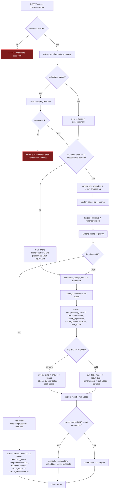

# Design Document — Hardened Semantic Cache

## Overview

This feature adds a **hardened semantic caching** stage to TokenQuick's FastAPI
backend (`backend/main.py` `/api/chat`, `phase == "generate"`). The stage sits
**after** the existing pre-inference redaction stage and **before** compression
and local inference. It embeds the redacted prompt on-device, looks it up in a
persistent local ChromaDB collection, and — on a sufficiently confident and
unambiguous match — serves the cached result, short-circuiting compression +
PERFORM/BUILD inference. On a miss the pipeline runs unchanged and the produced
result is stored for future hits.

The cache deliberately resists the collision / cache-poisoning weakness of a
naive cosine-similarity cache. Instead of serving whatever single nearest
neighbor clears a raw similarity threshold, it does **cluster-based validation**:
it retrieves the top-k nearest entries and serves a hit only when the top match
both clears `Minimum_Similarity` **and** is separated from the runner-up by at
least `Margin_Threshold`. An ambiguous top-two (small margin, or a tie) is a
miss.

### Guiding constraints (traceable through every section)

- **Nothing leaves the machine** (Req 1.4, 2.5, Non-Goals). Embedding uses
  `all-MiniLM-L6-v2` via sentence-transformers, CPU-only, loaded from a local
  artifact. The vector store is a local ChromaDB persistent collection. The
  decision log is a local JSONL file. No network call is made anywhere in the
  stage — embedding, lookup, store, log, benchmark, or stress test.
- **Redacted-prompt-only** (Req 1.2, 2.4, 6.4, 9.2, 9.8). The cache embeds,
  looks up, and stores **only** the `Redacted_Prompt` produced by the redaction
  stage. The raw requirements summary and any pre-redaction text never enter
  the cache, its embeddings, its metadata, or its log. Crucially, the redacted
  prompt itself is **never stored as retrievable text** — it is represented only
  by its embedding vector plus an opaque id.
- **Fail-closed interaction with redaction** (Req 6.6, 9.1). If redaction fails
  the request already aborts with HTTP 500 *before* the streaming generator
  runs (existing behavior); the cache is never reached, so no embed / lookup /
  store happens for a failed-redaction request.
- **Graceful degradation** (Req 1.6, 1.7, 2.6). If the embedding model or the
  vector store fails to load/open at startup, the entire cache stage is cleanly
  disabled and every generate request is treated as a miss — the pipeline keeps
  working exactly as it does today.
- **Independently toggleable & benchmarkable** (Req 7, 8, 10), consistent with
  the compression and redaction stages.

### Where the stage plugs into the existing code

The existing generate handler already does, **pre-stream in the handler body**
(not in the streaming generator):

1. reject 400 if `sessionId` missing/empty,
2. `gen_summary = extract_requirements_summary(messages)`,
3. `gen_stage_enabled = redaction_state.is_enabled()`,
4. if enabled: `redact(...)` → `gen_redacted` (fail-closed 500),
5. `compress_prompt_detailed(gen_redacted)` → `gen_compressed_detail`,
6. `verify_placeholders(...)` (fail-closed 500).

The semantic cache is inserted **between step 4 and step 5**: after
`gen_redacted` exists and redaction is OK, embed + lookup. On a **HIT** we skip
steps 5–6 (compression) entirely and set a flag + cached payload the generator
streams. On a **MISS** we run compression as today and mark the request for
store-after-generation.

---

## Architecture

### New backend modules

| Module | Responsibility | Mirrors |
| --- | --- | --- |
| `backend/semantic_cache.py` | Embedding model loader, Chroma client/collection opener, `CacheDecision` dataclass, hardened `lookup()`, `store()`, and the policy helpers used by the stress test. | Combines the loader pattern of `redactor.load_ner_model` + the orchestration style of `redact()`. |
| `backend/cache_state.py` | Thread-safe, in-memory, JSON-serializable runtime state: toggle (default enabled) + per-session decision counts + cumulative tokens/time saved for `cache_report`. | `redaction_state.py` exactly. |
| `backend/cache_log.py` | Append-only JSONL cache-decision log (timestamp, session id, decision, scores, margin — **no raw values**). | `audit_log.py` exactly. |
| `backend/cache_stress_test.py` | Offline CLI dev tool: loads an `Adversarial_Prompt_Set` with group labels, runs naive vs hardened policy, reports wrong-hit counts/rates deterministically. Not a served endpoint. | New; reuses `semantic_cache` policy helpers. |

Two new FastAPI endpoints (`GET`/`POST /api/cache/toggle`) mirror
`/api/redaction/toggle`, wired to the `cache_state` singleton. The startup
`lifespan` handler is extended to load the embedding model + open the Chroma
collection once.

### Generate-phase flow (Mermaid)



The `cache_report` / `cache_benchmark` annotations are emitted on **both**
paths before the finish frame (Req 7.1, 10.5). On the HIT path compression is
reported as **skipped** (Req 9.6); on the MISS path compression annotations are
real, as today.

---

## Components and Interfaces

### `backend/semantic_cache.py`

Follows `redactor.py`'s conventions: heavy deps imported lazily inside the
loader; a load failure returns `None` (never raises); the orchestration
functions are otherwise pure/deterministic and make no network call.

```python
# ---- configuration defaults (Req 3.3) ----
DEFAULT_TOP_K: int = 5
DEFAULT_MIN_SIMILARITY: float = 0.85
DEFAULT_MARGIN_THRESHOLD: float = 0.05

# ChromaDB persistent directory (local, on-device).
DEFAULT_CACHE_DIR = os.path.join(os.path.dirname(__file__), "cache_store")
COLLECTION_NAME = "semantic_cache"
NO_RUNNER_UP_SENTINEL = 0.0   # Req 3.9, 4.4

# ---- embedding model loader (Req 1.4, 1.5, 1.6, 1.7) ----
def load_embedding_model():
    """Load all-MiniLM-L6-v2 (CPU-only) from the local sentence-transformers
    artifact, or return None on ANY failure — mirrors redactor.load_ner_model.
    sentence-transformers is imported LAZILY here so the module imports cleanly
    without it. device='cpu' forces CPU; no GPU required; no network call
    (the artifact must already be on disk / in the local HF cache)."""

def embed(model, text: str) -> list[float]:
    """Return the deterministic embedding for `text` (Req 1.1, 1.8).
    encode(text, normalize_embeddings=True) so vectors are unit-length and the
    cosine space is well-behaved."""

# ---- vector store opener (Req 2.1, 2.3, 2.6) ----
def open_vector_store(path: str = DEFAULT_CACHE_DIR):
    """Open a persistent local Chroma collection configured for cosine space:
        client = chromadb.PersistentClient(path=path)
        client.get_or_create_collection(
            COLLECTION_NAME, metadata={"hnsw:space": "cosine"})
    Returns the collection, or None on ANY failure (Req 2.6). No network call."""

# ---- decision record ----
@dataclass(frozen=True, slots=True)
class CacheDecision:
    decision: str            # "hit" | "miss"
    top_score: float         # Similarity_Score of Top_Match (or 0.0 if none)
    runner_up_score: float   # Similarity_Score of Runner_Up (sentinel if none)
    margin: float            # top_score - runner_up_score (Req 3.4)
    latency_ms: float        # lookup start -> decision (Req 10.1)
    entry_id: str | None     # Top_Match id when hit, else None
    candidate_count: int     # number of candidates returned (0..top_k)

# ---- hardened lookup (Req 3) ----
def lookup(collection, embedding, *, top_k=DEFAULT_TOP_K,
           min_similarity=DEFAULT_MIN_SIMILARITY,
           margin_threshold=DEFAULT_MARGIN_THRESHOLD) -> tuple[CacheDecision, dict | None]:
    """Returns (decision, cached_entry_or_None). cached_entry is the Chroma
    document + metadata for the Top_Match ONLY when decision.decision == 'hit'."""

# ---- policy helpers (shared with the stress test, Req 5.4/5.5) ----
def hardened_decision(scores, *, min_similarity, margin_threshold) -> tuple[str, float, float, float]:
    """Pure function over a descending list of similarity scores.
    Returns (decision, top_score, runner_up_score, margin). No I/O. This is the
    single source of truth for Req 3.4-3.10 and is unit/property tested directly."""

def naive_decision(scores, *, min_similarity) -> str:
    """Baseline policy for the stress test (Req 5.4): hit iff top >= min_similarity,
    ignoring the margin. Pure."""

# ---- store on miss (Req 6) ----
def store(collection, embedding, result_text: str, metadata: dict) -> bool:
    """Add one Cache_Entry (embedding + document=result_text + scalar metadata).
    id = uuid4(). Returns True on success, False on failure (Req 6.8) — never
    raises into the request path. No raw prompt/sensitive value is passed in."""
```

**Cosine-similarity derivation (Req 3.1).** The collection is configured with
`hnsw:space="cosine"`, so Chroma query results return a **cosine distance** per
candidate. With unit-normalized embeddings, `similarity = 1.0 - distance`. We
compute this per candidate, then sort descending to get `Top_Match` /
`Runner_Up`. (We clamp to `[-1.0, 1.0]` defensively against float noise.)

### `backend/cache_state.py` (mirrors `redaction_state.py`)

```python
class CacheState:
    def __init__(self):
        self._lock = threading.Lock()
        self._enabled = True                 # default enabled (Req 8.6)
        self._cache_available = False        # set True once model+store load (Req 1.6/2.6)
        # session_id -> {"hits": int, "misses": int,
        #                "tokensSaved": int, "computeTimeSavedMs": int}
        self._sessions: dict[str, dict] = {}

    # toggle (Req 8.3/8.4/8.6)
    def is_enabled(self) -> bool: ...
    def set_enabled(self, v: bool) -> None: ...

    # availability (Req 1.6/1.7/2.6) — cache runs only when enabled AND available
    @property
    def cache_available(self) -> bool: ...
    def set_cache_available(self, v: bool) -> None: ...

    # per-decision accounting (Req 7.2/7.3)
    def record_decision(self, session_id: str, *, hit: bool,
                        tokens_saved: int = 0, compute_ms_saved: int = 0) -> None: ...

    # JSON-serializable snapshot for the cache_report annotation (Req 7.2-7.4)
    def report_for(self, session_id: str) -> dict:
        # {"hits","misses","decisions","hitRate",
        #  "tokensSavedFromCache","computeTimeSavedMs"}
        ...

    def reset_session(self, session_id: str) -> None: ...

state = CacheState()
```

`report_for` computes `hitRate = hits / decisions` (0.0..1.0; `decisions == 0`
→ `hitRate = 0.0`). Every returned dict is a fresh copy, safe for `json.dumps`.

### `backend/cache_log.py` (mirrors `audit_log.py`)

```python
DEFAULT_CACHE_LOG_PATH = os.path.join(os.path.dirname(__file__), "cache_decisions.jsonl")

class CacheLog:
    """Append-only JSONL cache-decision log. Public surface is ONLY the
    constructor, a read-only `path`, and `append(...)`. No clear/delete/
    truncate/overwrite/rotate; file is only ever opened in append mode."""
    def __init__(self, path: str = DEFAULT_CACHE_LOG_PATH): ...
    @property
    def path(self) -> str: ...
    def append(self, session_id: str, decision: str, *,
               top_score: float, runner_up_score: float, margin: float) -> bool:
        # entry = {timestamp (ISO-8601), session_id, decision,
        #          top_score, runner_up_score, margin}
        # No raw prompt, redacted-prompt text, or sensitive value (Req 4.3).
        # Returns True on success; False on failure (logged WARNING) (Req 4.6).
```

`runner_up_score` is written as the sentinel `0.0` when no runner-up exists
(Req 4.4); to make "no runner-up" unambiguous in the log we also write a scalar
`had_runner_up: bool`. Append-only mode guarantees prior entries are unchanged
(Req 4.5).

### `backend/cache_stress_test.py` (offline dev tool, Req 5)

```python
def load_adversarial_set(path) -> list[dict]:
    """Each item: {"prompt": str, "group": str}. Missing/empty group -> raise
    ValueError (Req 5.3). Redacts each prompt before embedding so no raw
    sensitive value carried in the set reaches the report (Req 5.11)."""

def run_stress_test(prompt_set, *, model, top_k, min_similarity, margin_threshold) -> dict:
    """For each prompt: embed all others, score, evaluate naive_decision and
    hardened_decision; count a Wrong_Hit when a served entry's group != query
    group (Req 5.6). Deterministic given the same set/config/model (Req 5.8).
    Empty set -> zero prompts, 0.0 rates (Req 5.10). Returns:
      {"promptsEvaluated","naiveWrongHits","naiveWrongHitRate",
       "hardenedWrongHits","hardenedWrongHitRate"}   (Req 5.7)."""

if __name__ == "__main__":  # CLI only — never a served endpoint (Req 5.1)
    ...
```

The tool imports the same `hardened_decision` / `naive_decision` /
`load_embedding_model` used by the request path, so it measures the exact
production policy.

### FastAPI endpoints (mirror redaction toggle)

```python
@app.get("/api/cache/toggle")
async def get_cache_toggle():
    return {"enabled": cache_state.is_enabled()}      # Req 8.4

@app.post("/api/cache/toggle")
async def set_cache_toggle(body: ToggleBody):         # reuse existing ToggleBody
    cache_state.set_enabled(body.enabled)             # Req 8.3
    return {"enabled": cache_state.is_enabled()}
```

Note: `is_enabled()` reflects the toggle only. The stage actually runs when
`cache_state.is_enabled() and cache_state.cache_available` — availability is set
by the lifespan loader (Req 1.6/2.6) and is not user-toggleable.

### Frontend

- `frontend/components/CacheReport.tsx` — a presentational panel (mirrors
  `RedactionReport.tsx`) showing hit rate, tokens saved from cache, compute time
  saved, and the cache benchmark (lookup latency, hit/miss). Empty state when
  the session has zero decisions (Req 7.9).
- `page.tsx` `processLine` gains `cache_report` and `cache_benchmark` handlers,
  session-guarded like redaction (Req 7.8), plus one small backward-compatible
  tolerance for the compression `skipped` flag.
- A cache on/off switch added to `RedactionSettings` (or a sibling
  `CacheSettings`) hitting `/api/cache/toggle`.

---

## Data Models

### Query-time / decision types

`CacheDecision` (above) is the in-memory record for a single lookup. It is the
input to the cache log append, the `cache_report` accounting, and the
`cache_benchmark` annotation.

### Cached_Result schema in ChromaDB

ChromaDB stores three parallel arrays per entry: **embeddings**, **documents**
(one string each), and **metadatas** (one flat dict each, whose values must be
**scalar** — `str`/`int`/`float`/`bool`; no nested dicts/lists). The schema:

- **embedding** — the unit-normalized `all-MiniLM-L6-v2` vector of the
  **Redacted_Prompt**. This is the *only* representation of the prompt in the
  store (Req 6.4, 9.8). The redacted prompt text is **never** stored as a
  readable field.
- **document** — the **RESULT text**, i.e. the generated response served on a
  future hit (Req 2.2, 6.2). For BUILD this is the assembled code string; for
  PERFORM this is the answer text. This is a *result*, not a prompt — it is the
  same text that streams to the user today via `0:` deltas. (It is not the
  redacted prompt.)
- **id** — a `uuid4()` string (Req 6 dedupe/update below).
- **metadata** — all scalar (see table). No raw prompt, no redacted-prompt text,
  no sensitive value (Req 2.4, 6.4).

| metadata key | type | source | used on hit for |
| --- | --- | --- | --- |
| `task_mode` | str `"build"`\|`"perform"` | classified intent for the miss run | `task_mode` annotation (Req 9.4 label) |
| `created_at` | str (ISO-8601 UTC) | store time | audit/debug |
| `real_input_tokens` | int | real usage from the miss run | `cache_report`/`cache_benchmark` tokens saved (Req 6.3, 7.6, 10.3) |
| `real_output_tokens` | int | real usage | same |
| `real_total_tokens` | int | `input + output` | tokens saved figure |
| `inference_time_ms` | int | measured wall-clock of the downstream produce step | compute time saved (Req 6.3, 7.3, 10.3) |
| `result_char_len` | int | `len(result_text)` | sanity/telemetry only |

**Scalar-only constraint decision (Req 4 note in the prompt).** Token counts are
stored as **separate scalar fields** (`real_input_tokens`, `real_output_tokens`,
`real_total_tokens`), *not* as a JSON-string blob. Justification: they are a
tiny fixed set of non-sensitive integers; separate scalar columns are the most
direct fit for Chroma's flat metadata model, keep the hit-path reconstruction
trivial, and avoid parsing. (If a larger structured blob were ever needed we
would store a single JSON-string metadata field containing only numeric
telemetry — but that is not needed here.)

**What is NOT stored anywhere in the entry:** the raw requirements summary, the
raw prompt, the redacted-prompt text, or any sensitive value. The redacted
prompt exists in the store only as the embedding vector + the opaque `uuid4`
id.

**BUILD vs PERFORM difference and the acknowledged BUILD tradeoff.**
- PERFORM: `document` = answer text; `task_mode = "perform"`; token/time metadata
  from `invoke_sync` usage + measured time. A hit faithfully reproduces the
  PERFORM output and a `real_usage`-style panel (see HIT-path section).
- BUILD: `document` = assembled `result_text`; `task_mode = "build"`; token/time
  metadata from the router's aggregated `real_usage` + measured time. **The
  per-subtask router telemetry (`router_plan`, `subtask_update`,
  `savings_breakdown`, `perSubtask`) cannot be faithfully reconstructed on a
  hit** because those describe a specific decomposition/execution that did not
  re-run. **Tradeoff (documented):** on a BUILD hit we do **not** replay
  `router_plan` / `subtask_update` / `savings_breakdown`. We stream the cached
  code exactly, emit `task_mode: "build"`, and emit a single reconstructed
  `real_usage`-style annotation (from stored token counts, empty `perSubtask`)
  plus the `cache_report`/`cache_benchmark` that make clear the result was
  *served from cache*. The Task Router panel simply does not populate on a hit,
  which is acceptable: the user sees the same generated output and the cache
  panel explains why the router telemetry is absent.

**Id scheme, dedupe & update (Req 6.2, 6.5).** Each store creates a fresh
`uuid4()` entry. A hit **never** creates a new entry (Req 6.5). For a **miss
whose query embedding is near-identical to an existing entry** (Req 6 intent),
we avoid unbounded duplicate growth with an *upsert-on-near-duplicate* rule at
store time: before adding, run one internal `lookup()` of the just-produced
embedding; if it would itself be a **hit** against an existing entry, `update`
that entry's document/metadata in place (same id) instead of adding a new one.
Otherwise `add` a new `uuid4` entry. This keeps the store from accumulating
redundant near-identical vectors while never mutating the append-only *log*.

### Runtime state model (`cache_state`)

Per session: `{hits, misses, tokensSaved, computeTimeSavedMs}` (monotonic
non-decreasing). In-memory only, never persisted (the *vector store* persists;
session telemetry does not, matching `redaction_state`).

### Cache decision log entry (`cache_log`)

`{timestamp, session_id, decision, top_score, runner_up_score, margin,
had_runner_up}` — scalar-only, no raw values (Req 4.1, 4.3, 4.4).

---

## HIT-path streaming (detailed)

This is the crux: on a cache hit the backend must emit frames that the existing
`page.tsx` `processLine` loop renders like a fresh result, with **minimal** (one
tolerant guard) frontend change. The existing loop handles `0:` text deltas
(appended to the assistant message, then `setGeneratedCode(accumulated)` at end)
and `2:` annotations dispatched by `payload.event`. We reuse those exact frame
types (Req 9.4).

### Frames yielded on a HIT (exact, in order)

All frames come from the streaming generator; the pre-stream compression block
was **skipped** for this request.

1. **`compression_stats` — marked skipped (Req 9.6).** Same event name so the
   frontend's `setStats` runs, but with a new boolean `skipped: true` and
   zeroed/passthrough numbers so no field is missing:
   ```json
   2:[{"event":"compression_stats","skipped":true,
       "originalTokens":0,"compressedTokens":0,"ratio":0,"multiplier":1,
       "compressedPrompt":"(compression skipped — served from cache)"}]
   ```
2. **`compression_diff` — emitted, marked skipped, empty tokens.** We *do* emit
   it (rather than omit) so the frontend never waits on a missing frame; empty
   `tokens` means `CompressionDiffPanel` is not rendered (guarded by
   `compressionDiff.tokens.length > 0`), which is exactly the "nothing to diff"
   behavior we want. Include the skipped flag for consumers:
   ```json
   2:[{"event":"compression_diff","skipped":true,"original":"","tokens":[],"multiplier":1}]
   ```
3. **`redaction_report` + `redaction_benchmark`** — via the existing
   `_redaction_annotations(session_id, gen_stage_enabled, gen_redaction_result)`
   helper, unchanged (redaction still ran this request; Req 9.5).
4. **`cache_report` — marked as a hit (Req 7.1, 7.5, 9.5, 10.5).** See the
   annotation contract below. `hit: true`, this-request `tokensSavedFromCache`
   and `computeTimeSavedMs` derived from the served entry's metadata (Req 7.6),
   plus cumulative session values.
5. **`cache_benchmark` — hit (Req 10.5).** `lookupLatencyMs` from the decision,
   `decision: "hit"`, `tokensSaved` and `inferenceTimeSavedMs` from stored
   metadata.
6. **`task_mode`** — from stored metadata (`"build"` or `"perform"`) so the
   frontend labels the output correctly (Req 9.4).
7. **reconstructed `real_usage`** (see "Do we re-emit real_usage?" below).
8. **cached result text via `0:` deltas** — the stored `document` streamed in
   the **same 16-char chunks** as the existing PERFORM/BUILD streaming, so
   `accumulated` fills and `setGeneratedCode(accumulated)` at stream end fills
   exactly as today (Req 9.4).
9. **`finish_message("stop")`** — LAST (Req 9.4).

Ordering note: annotations (`2:`) are order-independent for the frontend (each
just updates its own state slice), but we keep compression → redaction → cache →
task_mode → real_usage → text → finish so it reads identically to the MISS path
and any future ordered consumer stays happy. `finish` is always last.

### Do we re-emit `real_usage` on a hit?

**Decision: yes — emit a reconstructed `real_usage`-style annotation** built from
the stored metadata, with `perSubtask: []`. Justification: the frontend's
`RealUsagePanel` renders whenever `realUsage` is set; if we skipped it, a hit
would show the cached code but a blank token panel, which reads as a regression.
Reconstructing from `real_input_tokens` / `real_output_tokens` / `real_total_tokens`
(all stored) keeps the panel coherent and truthful — these are the *original*
measured token counts for producing this result, which is exactly what the panel
claims to show. Costs are `0.0` (local). We do **not** emit `savings_breakdown`
on a hit (it describes a routing run that did not happen); the `cache_report`
panel carries the cache-specific savings instead. This keeps every panel either
correctly populated or intentionally empty.

### HIT vs MISS frame sequence (side by side)

| # | MISS (unchanged pipeline) | HIT (short-circuit) |
| --- | --- | --- |
| 1 | `compression_stats` (real numbers) | `compression_stats` (`skipped:true`, zeros) |
| 2 | `compression_diff` (real tokens) | `compression_diff` (`skipped:true`, `tokens:[]`) |
| 3 | `redaction_report` | `redaction_report` |
| 4 | `redaction_benchmark` | `redaction_benchmark` |
| 5 | `cache_report` (`hit:false`) | `cache_report` (`hit:true`) |
| 6 | `cache_benchmark` (`decision:"miss"`, zeros) | `cache_benchmark` (`decision:"hit"`, savings) |
| 7 | `task_mode` (classified) | `task_mode` (from metadata) |
| 8 | PERFORM: stream `0:` deltas → `real_usage`  •  BUILD: router annots → stream `0:` deltas | stream cached `0:` deltas → reconstructed `real_usage` |
| 9 | `finish_message` | `finish_message` |

(The MISS path additionally runs the PERFORM/BUILD work and then calls
`semantic_cache.store(...)` after step 8; the HIT path does no store — Req 6.5.)

### Minimal frontend change required

Only one small, backward-compatible tolerance: the compression handlers must not
break when `skipped:true` arrives with zeroed fields. They already read fields
defensively (`payload.multiplier ?? 1`) and the diff panel is already guarded by
`tokens.length > 0`, so functionally it works today; we add:

- In `compression_stats` handling: keep a `skipped` flag in `CompressionStats`
  and, when set, render the Token Compression Report card with a
  "skipped (served from cache)" badge instead of a multiplier. This is display
  only — no crash risk because all numeric fields are still present (zeros).

No other change to the streaming loop is needed for the hit to render.

---

## Hardened lookup algorithm (Req 3)

```
function lookup(collection, query_embedding, top_k, min_similarity, margin_threshold):
    t0 = perf_counter()

    # Req 3.1/3.2: retrieve up to top_k nearest; fewer if the store holds fewer.
    n = collection.count()
    if n == 0:                                             # Req 3.10
        decision = CacheDecision("miss", 0.0, SENTINEL_0, 0.0, elapsed_ms(t0), None, 0)
        return decision, None
    k = min(top_k, n)
    res = collection.query(query_embeddings=[query_embedding],
                           n_results=k,
                           include=["distances","documents","metadatas"])

    distances = res["distances"][0]                        # cosine distances
    # cosine similarity from cosine distance (hnsw:space="cosine"): sim = 1 - dist
    sims = [clamp(1.0 - d, -1.0, 1.0) for d in distances]  # Req 3.1
    # Chroma already returns ascending distance == descending similarity, but
    # sort defensively to guarantee the ranking invariant.
    order = argsort_descending(sims)

    top_score = sims[order[0]]
    if len(order) >= 2:
        runner_up_score = sims[order[1]]                   # Req 3.4
    else:
        runner_up_score = SENTINEL_0                       # Req 3.9 (0.0)

    margin = top_score - runner_up_score                   # Req 3.4
    # Req 3.8: exact tie for the top score -> margin forced to 0.0.
    if len(order) >= 2 and sims[order[1]] == top_score:
        margin = 0.0

    # Req 3.5 / 3.6 / 3.7:
    # NOTE: the margin comparison uses a 1e-9 epsilon (`margin >= Margin_Threshold - 1e-9`)
    # to avoid IEEE-754 boundary misses at an exactly-threshold margin (e.g.
    # 0.95 - 0.90 == 0.04999999999999993), so the [0.95, 0.90] example is a hit as intended.
    if top_score >= min_similarity and margin >= margin_threshold:
        decision = "hit"
    else:
        decision = "miss"   # below-min, OR ambiguous small margin, OR tie

    d = CacheDecision(decision, top_score, runner_up_score, margin,
                      elapsed_ms(t0), id_of(order[0]) if decision=="hit" else None, k)
    entry = {document, metadata} for order[0] if decision=="hit" else None
    return d, entry
```

`hardened_decision(scores, ...)` is the pure core (the middle block operating on
`sims`), extracted so the stress test and property tests exercise the exact same
logic without a live collection. It handles: zero candidates (Req 3.10, empty
`scores`), single candidate (Req 3.9, runner-up sentinel 0.0), ties (Req 3.8,
margin 0.0 → miss when `margin_threshold > 0`), below-min (Req 3.6), and
ambiguous (Req 3.7).

---

## Embedding model + Vector_Store lifecycle (Req 1, 2)

Extend the existing `lifespan` handler (which already loads the NER model and
builds redaction singletons). Add module-level globals and load them once:

```python
embedding_model = None        # sentence-transformers model or None
vector_store = None           # Chroma collection or None
cache_log: CacheLog | None = None

@asynccontextmanager
async def lifespan(app: FastAPI):
    global ner_detector, custom_terms_store, custom_term_detector, audit_log
    global embedding_model, vector_store, cache_log
    # ... existing redaction load ...

    # ── Semantic cache load (Req 1.5, 2.1) ──
    embedding_model = load_embedding_model()          # None on failure (Req 1.6)
    vector_store = open_vector_store()                # None on failure (Req 2.6)
    cache_log = CacheLog()
    available = embedding_model is not None and vector_store is not None
    cache_state.set_cache_available(available)        # Req 1.6/1.7/2.6
    if not available:
        logger.warning("Semantic cache disabled: embedding model or vector store unavailable")
    yield
```

- **CPU-only** (Req 1.4): `load_embedding_model` calls
  `SentenceTransformer(name, device="cpu")`; no GPU is ever requested.
- **Local artifact, no network** (Req 1.4, 2.5): the model must resolve from the
  local sentence-transformers/HF cache; loading runs offline. Any load or open
  failure → `None` → whole stage disabled (embedding, lookup, store — Req 1.7),
  and the pipeline continues normally as if every request were a miss.
- **Fixed dimensionality & determinism** (Req 1.3, 1.8): a single loaded model
  produces the same 384-dim vector for the same text every call; `normalize_
  embeddings=True` keeps vectors unit-length for the cosine space.
- **Persistence** (Req 2.3): `PersistentClient(path="backend/cache_store")`
  persists entries across restarts on local disk only.

---

## main.py wiring (Req 8, 9)

The nuance: compression currently happens **pre-stream** in the handler body.
For a hit we must **not** compress. So the pre-stream block is restructured to
insert the cache lookup between redaction and compression, and to defer
compression until we know it is a miss.

```python
# --- new closed-over generate-phase state ---
gen_cache_enabled = False          # snapshot: toggle AND availability
gen_cache_hit = False
gen_cache_decision = None          # CacheDecision
gen_cache_entry = None             # {document, metadata} on hit
gen_query_embedding = None         # reused for store-on-miss

if phase == "generate":
    if not session_id:
        raise HTTPException(400, "missing sessionId")     # Req 9.9
    gen_summary = extract_requirements_summary(messages)
    gen_stage_enabled = redaction_state.is_enabled()

    if gen_stage_enabled:
        # ... existing redact() (fail-closed 500) -> gen_redacted ...
        # (redaction failure aborts here; cache never runs — Req 6.6)
    else:
        gen_redacted = gen_summary

    # ── Semantic cache lookup — AFTER redaction, BEFORE compression ──
    gen_cache_enabled = cache_state.is_enabled() and cache_state.cache_available  # Req 8.1/8.2
    if gen_cache_enabled:
        gen_query_embedding = embed(embedding_model, gen_redacted)   # Req 1.1/9.2
        gen_cache_decision, gen_cache_entry = lookup(vector_store, gen_query_embedding)
        cache_log.append(session_id, gen_cache_decision.decision,
                         top_score=gen_cache_decision.top_score,
                         runner_up_score=gen_cache_decision.runner_up_score,
                         margin=gen_cache_decision.margin)           # Req 4.1
        gen_cache_hit = gen_cache_decision.decision == "hit"

    if not gen_cache_hit:
        # MISS (or cache disabled): compress pre-stream exactly as today.
        gen_compressed_detail = compress_prompt_detailed(gen_redacted)   # Req 9.7
        if gen_stage_enabled and not verify_placeholders(...):
            raise HTTPException(500, "redaction failed")
    # HIT: skip compression entirely (Req 9.3). gen_compressed_detail stays None.
```

Inside the streaming generator, `phase == "generate"`:

```python
if gen_cache_hit:
    # record accounting + emit hit-path frames (see HIT-path section)
    tokens_saved = gen_cache_entry["metadata"]["real_total_tokens"]
    time_saved   = gen_cache_entry["metadata"]["inference_time_ms"]
    cache_state.record_decision(session_id, hit=True,
                                tokens_saved=tokens_saved,
                                compute_ms_saved=time_saved)          # Req 7.6/10.3
    yield compression_stats(skipped=True)
    yield compression_diff(skipped=True)
    for f in _redaction_annotations(session_id, gen_stage_enabled, gen_redaction_result):
        yield f
    yield cache_report_frame(session_id, hit=True, tokens_saved=..., time_saved=...)
    yield cache_benchmark_frame(gen_cache_decision, tokens_saved=..., time_saved=...)
    yield data_annotation({"event":"task_mode","mode": md["task_mode"]})
    yield reconstructed_real_usage(md)
    result_text = gen_cache_entry["document"]
    for i in range(0, len(result_text), 16):
        yield text_delta(result_text[i:i+16]); await asyncio.sleep(0)
    yield finish_message("stop")
    return

# MISS path: existing compression_stats/diff + redaction annots, then ALSO:
if gen_cache_enabled:  # a real miss (not disabled)
    cache_state.record_decision(session_id, hit=False)                # Req 7.2
    yield cache_report_frame(session_id, hit=False, tokens_saved=0, time_saved=0)
    yield cache_benchmark_frame(gen_cache_decision, tokens_saved=0, time_saved=0)  # Req 10.4
else:  # cache disabled/unavailable
    yield cache_report_disabled_frame(session_id)                     # Req 8.5
# ... existing task_mode + PERFORM/BUILD ...
```

**Capturing the produced result + real usage for store-on-miss (Req 6).** Both
downstream paths already surface exactly what we need:

- **PERFORM:** `answer, usage = await invoke_sync(...)`. Wrap the produce step in
  `t0 = perf_counter()` / `inference_time_ms = int((perf_counter()-t0)*1000)`.
  `result_text = answer`; `real_input_tokens = usage["input_tokens"]`,
  `real_output_tokens = usage["output_tokens"]`.
- **BUILD:** `result_text = await run_task_router(...)`, and the router emits a
  `real_usage` annotation. We intercept it via the existing `collect_emit`
  buffer: scan `pending_events` for the `real_usage` event and read
  `realInputTokens` / `realOutputTokens` / `realTotalTokens`. Time it the same
  way around the `run_task_router` call.

After the result is fully produced (non-empty) and if `gen_cache_enabled and not
gen_cache_hit` (Req 6.2, 6.7):

```python
if gen_cache_enabled and not gen_cache_hit and result_text.strip():
    metadata = {
        "task_mode": intent, "created_at": now_iso(),
        "real_input_tokens": ri, "real_output_tokens": ro,
        "real_total_tokens": ri + ro, "inference_time_ms": inference_time_ms,
        "result_char_len": len(result_text),
    }
    store(vector_store, gen_query_embedding, result_text, metadata)   # Req 6.2/6.3
    # store() returns False on failure and never raises — request already
    # completed and streamed (Req 6.8).
```

If the pipeline produced an empty result, we skip the store and leave the store
unchanged (Req 6.7).

---

## Data annotation contract

All mirror the redaction annotation shapes and are emitted before `finish`.

### `cache_report` (hit or miss) — Req 7.1–7.5, 10.5

```json
{
  "event": "cache_report",
  "sessionId": "<uuid>",
  "stageEnabled": true,
  "hit": true,
  "hitRate": 0.5,
  "tokensSavedFromCache": 812,
  "computeTimeSavedMs": 2400,
  "cumulativeTokensSaved": 1624,
  "cumulativeComputeTimeSavedMs": 4800,
  "hits": 2,
  "misses": 2,
  "decisions": 4
}
```

- `hit` — this request's decision (Req 7.5). `false` on a miss.
- `hitRate` — `hits / decisions` for the session, 0.0..1.0 (Req 7.2).
- `tokensSavedFromCache` / `computeTimeSavedMs` — **this request** (from served
  entry metadata on a hit; `0` on a miss) (Req 7.6, 10.3/10.4).
- `cumulative*` — session totals (Req 7.3).
- Cache-savings fields are **distinct** from any compression-savings fields so
  the dashboard shows them separately (Req 7.4).
- Contains no raw prompt / redacted text / sensitive value (Req 7.5).

### `cache_report` — disabled variant (Req 8.5)

```json
{"event":"cache_report","sessionId":"<uuid>","stageEnabled":false,
 "hit":false,"hitRate":0.0,"tokensSavedFromCache":0,"computeTimeSavedMs":0,
 "cumulativeTokensSaved":0,"cumulativeComputeTimeSavedMs":0,
 "hits":0,"misses":0,"decisions":0}
```

`stageEnabled:false` covers both "toggled off" and "unavailable at startup" —
the frontend renders a "cache off" note either way.

### `cache_benchmark` — Req 10.1–10.5

```json
{
  "event": "cache_benchmark",
  "sessionId": "<uuid>",
  "stageEnabled": true,
  "lookupLatencyMs": 7.3,
  "decision": "hit",
  "tokensSaved": 812,
  "inferenceTimeSavedMs": 2400
}
```

On a miss: `decision:"miss"`, `tokensSaved:0`, `inferenceTimeSavedMs:0`
(Req 10.4). Same layout/units/labeling as the redaction benchmark so the
dashboard reuses the `StatBadge` presentation (Req 10.6).

### `cache_benchmark_unavailable` — Req 10.7

```json
{"event":"cache_benchmark_unavailable","sessionId":"<uuid>"}
```

Emitted (and processing continues) if benchmark capture fails for any reason,
mirroring `redaction_benchmark_unavailable`.

---

## Error handling

| Condition (Req) | Behavior |
| --- | --- |
| Embedding model fails to load at startup (1.6, 1.7) | `embedding_model = None`; `cache_available = False`; whole stage disabled; every request treated as miss; no embed/lookup/store. |
| Vector store fails to open at startup (2.6) | `vector_store = None`; `cache_available = False`; stage disabled; every request treated as miss. |
| Custom-term store reload / redaction failure before cache (6.6, 9.1) | Redaction failure already aborts with HTTP 500 pre-stream; cache never runs; no embed/lookup/store. |
| Cache decision log append fails (4.6) | `cache_log.append` catches, logs WARNING, returns `False`; request continues; no raw value exposed. |
| Vector store returns 0 / 1 / tie candidates (3.10, 3.9, 3.8) | Miss / runner-up sentinel 0.0 / margin 0.0 → miss (when `margin_threshold>0`). |
| Storing a Cache_Entry fails (6.8) | `store()` catches, logs WARNING, returns `False`; the produced result was already streamed and returned; store left unchanged. |
| Downstream produces empty result after a miss (6.7) | Skip store; vector store unchanged. |
| Cache benchmark capture fails (10.7) | Emit `cache_benchmark_unavailable`; continue. |
| Toggle read/write (8.4/8.3) | `GET/POST /api/cache/toggle` return `{enabled}`; new state applies to requests that begin after the change; in-flight requests keep the snapshot taken at entry. |
| Generate without sessionId (9.9) | HTTP 400 before any embedding/lookup (existing guard, reused). |
| `cache_report` sessionId mismatch at dashboard (7.8) | Frontend ignores the annotation; leaves the current cache panel unchanged (session-guarded like redaction). |

---

## Correctness Properties

*A property is a characteristic or behavior that should hold true across all
valid executions of a system — essentially, a formal statement about what the
system should do. Properties serve as the bridge between human-readable
specifications and machine-verifiable correctness guarantees.*

The prework classified most acceptance criteria into a small set of universal
properties. Reflection collapsed the eight "no raw value" criteria into one
privacy property, folded the tie/single/zero/fewer-than-k cases into the single
decision-correctness property, and merged the two append-only criteria and the
two accounting criteria. The distinct executable properties follow. Suggested
library: **Hypothesis** (Python), each property configured for **≥100
iterations**.

### Property 1: No raw or redacted-prompt content ever reaches any cache sink

*For any* requirements summary containing arbitrary sensitive values, after the
semantic-cache stage runs on its redacted form, no raw sensitive value and no
substring of length ≥ 4 of the redacted-prompt text appears in any stored Chroma
**document** field, any stored Chroma **metadata** value, any `cache_report` /
`cache_benchmark` annotation, or any `Cache_Decision_Log` entry. The stored
document is always the produced **result** text (never the prompt), and the
redacted prompt is present only as the embedding vector and the opaque id.

**Validates: Requirements 1.2, 2.4, 4.3, 5.11, 6.4, 7.5, 9.2, 9.8**

### Property 2: Hardening never increases wrong hits on an adversarial set

*For any* `Adversarial_Prompt_Set` (each prompt labeled with an intended-match
group) and any valid configuration, the hardened cluster-based policy's
`Wrong_Hit` count is less than or equal to the naive single-threshold policy's
`Wrong_Hit` count on the same set, model, and configuration.

**Validates: Requirements 3.5, 3.7, 5.4, 5.5, 5.6**

### Property 3: Hardened decision correctness across all score sets

*For any* finite list of candidate similarity scores (including the empty list,
a single score, exact ties for the maximum, and near-margin pairs), the hardened
decision computes `runner_up = second-highest score` (or the sentinel `0.0` when
there is no runner-up), forces `margin = 0.0` when the top score is tied, sets
`margin = top - runner_up` otherwise, and returns `hit` **iff**
`top ≥ Minimum_Similarity` **and** `margin ≥ Margin_Threshold`; every other case
(including empty input, below-minimum top, and ambiguous small/zero margin with
`Margin_Threshold > 0`) returns `miss`.

**Validates: Requirements 3.1, 3.2, 3.4, 3.5, 3.6, 3.7, 3.8, 3.9, 3.10**

### Property 4: A hit short-circuits compression and inference

*For any* redacted prompt whose lookup is a hit, the request invokes **neither**
the compression step, **nor** the PERFORM inference path (`invoke_sync`),
**nor** the BUILD task-router path (`run_task_router`), and creates **no** new
`Cache_Entry`; the served response text equals the stored `Cached_Result`
document.

**Validates: Requirements 6.5, 9.3, 9.4**

### Property 5: Store-on-miss then an identical redacted prompt hits

*For any* redacted prompt that misses against the current store, storing a
non-empty produced result for it and then looking up the **same** redacted
prompt's embedding yields a hit whose served `Cached_Result` equals the stored
result and whose derived tokens/time-saved equal the stored metadata values.

**Validates: Requirements 2.2, 6.2, 6.3, 7.6, 9.7**

### Property 6: A disabled stage performs no embed, lookup, store, or log

*For any* redacted prompt, when the semantic cache is disabled (toggled off or
unavailable at startup), the stage performs no embedding, no lookup, no store,
and no cache-decision-log append, the request is passed to compression, and the
emitted `cache_report` indicates the stage was disabled.

**Validates: Requirements 1.6, 1.7, 2.6, 8.2, 8.5**

### Property 7: The cache decision log is append-only

*For any* sequence of cache-decision-log appends, every previously written line
is preserved byte-for-byte and in order after each subsequent append, and the
log's public surface exposes no operation that clears, truncates, overwrites, or
rotates the file.

**Validates: Requirements 4.2, 4.5**

### Property 8: Embedding is deterministic with fixed dimensionality

*For any* two strings embedded by the same loaded `Embedding_Model`, both
embeddings have identical length, and embedding the *same* string twice yields
an elementwise-identical vector.

**Validates: Requirements 1.3, 1.8**

### Property 9: Session accounting is consistent and non-negative

*For any* sequence of hit/miss decisions recorded for a session, the reported
`hitRate` equals `hits / decisions` in the range 0.0–1.0 (0.0 when there are no
decisions), and the cumulative `tokensSavedFromCache` and `computeTimeSavedMs`
are non-negative integers that never decrease as more decisions are recorded.

**Validates: Requirements 7.2, 7.3**

---

## Testing Strategy

### Dual approach

- **Property tests (Hypothesis, ≥100 iterations each)** implement Properties
  1–9 above. Each test is tagged with a comment referencing the design property:
  **`# Feature: hardened-semantic-cache, Property 3: hardened decision correctness ...`**.
  Property-based testing genuinely applies here: the hardened decision logic,
  the similarity-from-distance conversion, the store→lookup round-trip, the
  privacy invariant, and the accounting math are all pure/near-pure with large
  input spaces and clear universal statements.
- **Example / integration tests (FastAPI `TestClient`)** cover the frame stream
  and wiring that are not universally quantifiable:
  - HIT-path frame ordering: cached text arrives via `0:` deltas, `finish` is
    last, `cache_report(hit)` + redaction annotations + `task_mode` precede it
    (Req 9.4, 9.5, 10.5).
  - Skipped-compression annotation on a hit: `compression_stats.skipped == true`
    with all numeric fields present (Req 9.6).
  - MISS path proceeds to compression + PERFORM/BUILD then stores (Req 9.7).
  - `sessionId` missing → HTTP 400 before any embed/lookup (Req 9.9).
  - Toggle endpoints return `{enabled}` and default to enabled (Req 8.4, 8.6).
  - Startup fallbacks: model `None` / store `None` → `cache_available == False`
    and requests are miss-equivalent (Req 1.6, 2.6).
  - Failure fallbacks: log append failure (Req 4.6), store failure (Req 6.8),
    benchmark capture failure → `cache_benchmark_unavailable` (Req 10.7).
- **Stress-test determinism test:** run `run_stress_test` twice on the same
  generated set/config/model and assert identical counts and rates (Req 5.8);
  assert missing-group rejection (Req 5.3) and empty-set zeros (Req 5.10).
- **Frontend component tests** for `CacheReport`: hit-rate/savings rendering
  (Req 7.7), session-mismatch ignored (Req 7.8), empty state (Req 7.9), and the
  skipped-compression badge.

### Privacy-critical tests (highest priority)

Property 1 (no raw/redacted content in any sink), Property 6 (disabled stage
does nothing), and Property 4's "no new entry on hit" are the privacy- and
correctness-critical guarantees. Property 1 must run against the **actual**
Chroma documents + metadata, the `cache_report`/`cache_benchmark` payloads, and
the JSONL log lines — not mocks of them — so a regression that leaks prompt text
into any sink fails the build.

### PBT configuration

- Library: Hypothesis. Each property test uses `@settings(max_examples=100)` (or
  more).
- Score-set generators for Property 3 explicitly cover the partitions:
  empty list, single element, exact top ties, near-`Margin_Threshold` pairs, and
  below-`Minimum_Similarity` tops.
- The privacy generator injects known secret tokens (SSNs, emails, API keys,
  names) into prompts so Property 1 verifies both "no raw value" and "no ≥4-char
  substring of the redacted prompt" against real sinks.
- Embedding-dependent properties (5, 8, 2) load the real local model once per
  session; if the artifact is unavailable the test is skipped (never fails on a
  missing local model), consistent with the graceful-fallback design.

---

## Frontend Design

Keep changes minimal and consistent with the existing components
(`RedactionReport`, `RedactionSettings`, shared `StatBadge`).

### `frontend/components/CacheReport.tsx` (new)

A pure presentational panel mirroring `RedactionReport.tsx`, placed in the right
pane **visually separate** from the compression savings (Req 7.4, 7.7):

- Header "Cache Report" with a badge: `stageEnabled ? "<hitRate>% hit" : "Stage off"`.
- Disabled state (Req 8.5): note "Semantic cache disabled" and zeros.
- Empty state (Req 7.9): when `decisions === 0`, "No cache activity in this
  session."
- Populated state: `StatBadge`s for **Hit Rate** (`(hitRate*100).toFixed(0)%`),
  **Tokens Saved from Cache** (`cumulativeTokensSaved`), **Compute Time Saved**
  (`cumulativeComputeTimeSavedMs` ms) — cache-specific fields, distinct from the
  compression report (Req 7.4).
- Benchmark sub-block (Req 10.6): `StatBadge`s for **Lookup Latency (ms)**,
  **Decision** (hit/miss), **Tokens Saved**, **Inference Time Saved (ms)** using
  the same layout/labels/units as the redaction benchmark.

```ts
export interface CacheReportData {
  stageEnabled: boolean; hit: boolean; hitRate: number;
  tokensSavedFromCache: number; computeTimeSavedMs: number;
  cumulativeTokensSaved: number; cumulativeComputeTimeSavedMs: number;
  hits: number; misses: number; decisions: number;
}
export interface CacheBenchmarkData {
  stageEnabled: boolean; lookupLatencyMs: number;
  decision: "hit" | "miss"; tokensSaved: number; inferenceTimeSavedMs: number;
}
```

### `page.tsx` changes (minimal)

1. New state: `cacheReport`, `cacheBenchmark`; cleared in `triggerGenerate` and
   `resetChat` alongside the redaction panels.
2. `processLine` gains two handlers, **session-guarded** exactly like redaction
   (Req 7.8):
   ```ts
   if (payload?.event === "cache_report" && payload.sessionId === sessionId) {
     setCacheReport({ /* map fields with ?? defaults */ });
   }
   if (payload?.event === "cache_benchmark" && payload.sessionId === sessionId) {
     setCacheBenchmark({ /* map fields with ?? defaults */ });
   }
   if (payload?.event === "cache_benchmark_unavailable" && payload.sessionId === sessionId) {
     setCacheBenchmark(null);
   }
   ```
3. Compression `skipped` tolerance (the one small backward-compatible change):
   extend `CompressionStats` with `skipped?: boolean`, map
   `skipped: payload.skipped ?? false`, and when `stats.skipped` render a
   "skipped (served from cache)" badge in the Token Compression Report card
   instead of the `Nx smaller` badge. All numeric fields are still present
   (zeros), so nothing crashes.
4. Render `<CacheReport report={cacheReport} benchmark={cacheBenchmark} />` in
   the right pane near the Redaction Report, separated from the compression and
   savings panels.

### Cache on/off control

Add a second toggle row to `RedactionSettings` (or a small sibling
`CacheSettings`) that reads `GET /api/cache/toggle` on mount and flips via
`POST /api/cache/toggle`, reusing the existing switch markup and error handling
(Req 8.3, 8.4). Keeping it in the existing settings panel avoids new UI surface.

All frontend network calls remain to `http://localhost:8000` only — nothing
leaves the machine.
