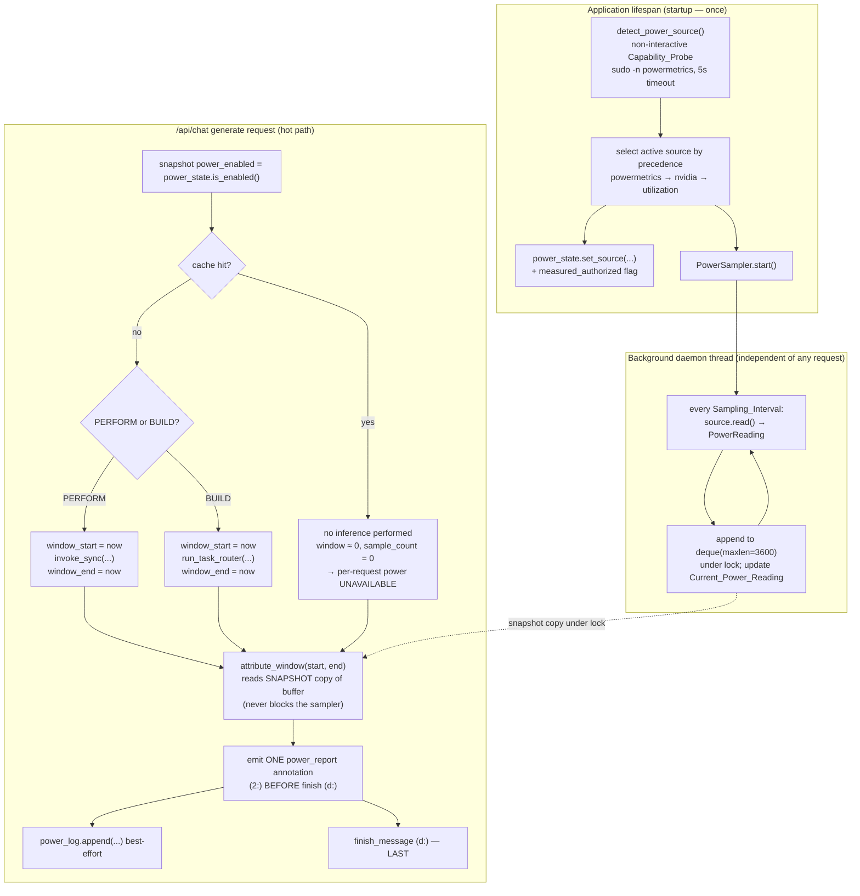

# Design Document

## Overview

TokenQuick adds a **hardware power / energy telemetry** stage to its FastAPI backend, mirroring the three stages already shipped: compression, pre-inference redaction, and the hardened semantic cache. A low-overhead **background sampler** periodically reads on-device hardware power (or, when true power is unavailable, a clearly-labeled utilization-based estimate). During the `/api/chat` "generate" phase, a **per-request attribution** brackets the inference window — the single `invoke_sync` call on the PERFORM path, or the full `run_task_router` span on the BUILD path — selects the sampler's readings that fall inside that window, and derives an average power (watts) and energy (joules) figure for the request. The result is streamed to the React dashboard as a new `power_report` data annotation and rendered in a new right-pane **Power / Energy** panel.

This design implements Requirements 1–10 of `.kiro/specs/hardware-power-tracking/requirements.md`.

### Guiding constraints

These constraints are load-bearing; every section below is subordinate to them.

- **Nothing leaves this machine.** The sampler, the source abstraction, the log, and all reporting are on-device. No module makes a network call to sample, attribute, log, benchmark, or report power (Req 1.6, 10.4).
- **Honesty: `measured | estimated | unavailable`.** Every reading and every reported figure carries exactly one quality flag. An estimate is never presented as a measurement, and a quality flag is never *upgraded* downstream (Req 2.10, 3.6, 3.7, 5.5, 10.5). This is the single most important invariant and is enforced structurally (worst-quality-wins resolution) and by property test.
- **No runtime sudo prompt, ever — and no sudo invocation unless opted in.** The privileged Apple Silicon source (`powermetrics`) is probed at most once at startup via a strictly non-interactive path (`sudo -n`), and ONLY when the operator sets `POWER_TRY_MEASURED=1`. If the flag is absent or `0` (the default), the backend never invokes `sudo` at all and goes straight to the estimated tier — avoiding even a logged failed-sudo attempt in hardened environments. When the flag is set but the source is not pre-authorized, the probe fails closed and the stage degrades to the estimated tier without ever prompting during a request (Req 3.2, 3.3, 10.2).
- **Low-overhead, non-blocking sampler.** Sampling runs on one shared daemon thread off the request hot path. The request path never awaits sampling, never holds a lock across the model call, and never blocks waiting for a reading; it computes from a snapshot copied under lock (Req 1.3, 10.1).
- **Apple Silicon unified-memory package power.** On the confirmed M5 target, CPU and GPU are components of one shared package power domain. The `PowerReading` records CPU, GPU, and package wattage as separate fields, but they describe one SoC package, not independent rails (Req 2.12, target constraint).

### Confirmed target environment

- Apple M5 (`Mac17,3`), macOS (Darwin arm64), unified-memory SoC.
- `/usr/bin/powermetrics` exists but requires root; `sudo -n powermetrics` fails closed without passwordless sudoers configured → **the default runtime tier on this machine is `estimated`** (psutil utilization × TDP model).
- No `nvidia-smi`.
- `psutil` is **approved** as a dependency (see Dependencies) and powers the estimated tier.
- Backend runs on Python 3.13 in the `backend/.venv` virtualenv.

### Dependencies

One new runtime dependency is added to `backend/requirements.txt`, pinned exactly to match the existing pinning discipline:

```
# Hardware power tracking — on-device utilization sampling for the estimated
# tier. psutil reads CPU utilization locally (no network); the estimated
# wattage is psutil.cpu_percent() × a configurable TDP model. On macOS psutil
# NEVER reports true wattage — it powers the ESTIMATED tier only. The MEASURED
# tier comes from the system `powermetrics` binary via a non-interactive probe
# (no Python dependency). Pinned to a Python 3.13-compatible (cp313) release.
psutil==6.1.0
```

`powermetrics` and `nvidia-smi` are system tools invoked as subprocesses; they are not Python dependencies. `powermetrics` is present on the target but privileged; `nvidia-smi` is absent on the target and treated as unavailable.

---

## Architecture

The stage comprises four new backend modules plus wiring in `main.py`, following the established Phase 1/2 module style (a state singleton like `cache_state.py`/`redaction_state.py`, an append-only log like `cache_log.py`/`audit_log.py`, and pure helpers wired — not reimplemented — in `main.py`).

| Module | Mirrors | Responsibility |
| --- | --- | --- |
| `backend/power_source.py` | (new abstraction) | `PowerReading` dataclass, the `PowerSource` sources, and `detect_power_source()` — the once-at-startup capability probe. |
| `backend/power_sampler.py` | (new) | `PowerSampler` — the single background daemon thread, the fixed-capacity buffer, `Current_Power_Reading`, and `attribute_window()`. |
| `backend/power_state.py` | `cache_state.py` | Toggle (default enabled), thread-safe; holds the detected source identity + whether the measured tier is authorized. |
| `backend/power_log.py` | `cache_log.py` | Append-only JSONL log; no raw values; only-append public surface. |
| `backend/main.py` (edits) | existing lifespan + generate handler | Extend `lifespan` to detect the source and start/stop the sampler; bracket the inference window; emit `power_report`; add `/api/power/*` endpoints. |

### Generate-phase flow with the independent sampler



The sampler and the request path share only the buffer lock, and the request path holds it *only* to copy a snapshot of the readings — never across the model call, never across any await (Req 1.3, 10.1). The `power_report` annotation is emitted on **every** path (hit, miss, PERFORM, BUILD, disabled) exactly once, before the `finish_message` `d:` frame, matching the existing ordering discipline where all `2:` annotations precede the terminal `d:` frame (Req 5.1).

---

## Components and Interfaces

### `backend/power_source.py`

The source abstraction plus concrete sources and the startup detection. Lazy imports (`psutil`, `subprocess`) so a missing dependency degrades to `unavailable` rather than crashing import. No source ever raises out of `read()`; no source makes a network call.

```python
from __future__ import annotations
from dataclasses import dataclass
from typing import Literal, Protocol

Quality = Literal["measured", "estimated", "unavailable"]


@dataclass(frozen=True)
class PowerReading:
    """A single timestamped power observation (Req 2.10, 2.12).

    Numeric fields are watts or None. None means "this source does not report
    this component" or "unavailable" — never a fabricated 0 (Req 3.8).
    `timestamp` is a monotonic-ish wall clock (time.time()) used for window
    selection. `quality` is exactly one honesty flag.
    """
    timestamp: float
    cpu_watts: float | None
    gpu_watts: float | None
    package_watts: float | None
    source: str
    quality: Quality


class PowerSource(Protocol):
    name: str
    def read(self) -> PowerReading: ...   # never raises; unavailable on failure


class PowermetricsSource:
    """Apple Silicon measured tier (Req 2.5, 2.12).

    read() runs `sudo -n powermetrics --samplers cpu_power -n 1 -i <ms>` with a
    Telemetry_Time_Budget timeout. The `-n` (non-interactive) sudo flag NEVER
    prompts: if passwordless sudoers is not configured the call fails
    immediately and read() returns an `unavailable` reading (Req 3.2). On
    success it PARSES the CPU / GPU / package power lines from powermetrics
    output and returns a `measured` reading with all three components.
    """
    name = "powermetrics"

class NvidiaSmiSource:
    """Discrete-GPU measured tier (Req 2.7). Absent on the M5 target.

    read() runs `nvidia-smi --query-gpu=power.draw --format=csv,noheader,nounits`.
    If the binary is absent the source is unavailable and readings are tagged
    `unavailable`.
    """
    name = "nvidia-smi"

class UtilizationEstimateSource:
    """psutil-backed estimated tier (Req 2.6, 2.8, 2.11).

    read() = psutil.cpu_percent() × a configurable TDP model → estimated watts,
    tagged `estimated`. If psutil is not importable the source is unavailable
    and readings are tagged `unavailable`. This is the DEFAULT active source on
    the M5 target (Req 2.9).
    """
    name = "utilization-estimate"
    def __init__(self, tdp_watts: float = 20.0, idle_watts: float = 2.0): ...


def probe_powermetrics_authorized(timeout_s: float = 5.0) -> bool:
    """The non-interactive Capability_Probe (Req 2.4), gated by POWER_TRY_MEASURED.

    Returns False IMMEDIATELY without invoking sudo unless the environment
    variable POWER_TRY_MEASURED == "1" — so by default the backend never runs
    `sudo` at all (no password prompt AND no logged failed-sudo attempt in
    hardened environments). When POWER_TRY_MEASURED=1, runs
    `sudo -n powermetrics --samplers cpu_power -n 1 -i 200` once with a 5s
    timeout and returns True ONLY on a clean exit within the budget. `-n`
    guarantees no password prompt; a TimeoutExpired, non-zero exit, or missing
    binary all return False (fail-closed → not authorized). Never raises.
    """


def detect_power_source(*, tdp_watts: float = 20.0) -> tuple[PowerSource, bool]:
    """Select the active source ONCE at startup (Req 2.2, 2.3, 2.9).

    Precedence: powermetrics → nvidia-smi → utilization-estimate; the first that
    is BOTH available AND authorized is selected. On the M5 target the probe
    fails closed and nvidia-smi is absent, so the utilization estimate is
    selected. Returns (active_source, measured_authorized). If nothing usable
    is available, returns a source whose readings are all `unavailable`.
    """
```

Design decisions and rationale:

- **`PowerReading` is `frozen`** so a reading cannot be mutated after creation — this makes the "no-upgrade" honesty invariant (Req 3.7) structurally hard to violate: a downstream stage cannot relabel a reading in place.
- **`None`, never `0`, for absent numbers** (Req 3.8, 5.4). A frozen `None` is the machine-checkable representation of "unavailable"; a measured `0.0` W is a legitimate value and must remain distinguishable.
- **Detection is once-at-startup and fixed for the process** (Req 2.2). The probe runs a single short `powermetrics` sample; its result is cached in `power_state`. No probe runs during a request.

### `backend/power_sampler.py`

```python
import collections, threading, time

class PowerAttribution:
    """Result of bracketing one Inference_Window (Req 4.2–4.10)."""
    avg_power_watts: float | None
    energy_joules: float | None
    cpu_avg_watts: float | None
    gpu_avg_watts: float | None
    package_avg_watts: float | None
    sample_count: int
    duration_seconds: float
    quality: Quality
    source: str


class PowerSampler:
    """One shared background sampler (Req 1.1–1.8, 8.1–8.3, 10.1).

    A single daemon thread calls source.read() every Sampling_Interval and
    appends the PowerReading to a fixed-capacity deque(maxlen=max_readings)
    under a lock, updating Current_Power_Reading. The request path NEVER holds
    this lock across a model call or an await: attribute_window copies a
    snapshot under the lock and computes OUTSIDE it.
    """
    def __init__(self, source: PowerSource, *,
                 interval_s: float = 0.25,          # default in [0.1, 1.0] (Req 1.2)
                 max_readings: int = 3600,          # Req 1.8
                 time_budget_s: float = 0.5):       # Req 3.5
        self._source = source
        self._interval = interval_s
        self._buf: collections.deque[PowerReading] = collections.deque(maxlen=max_readings)
        self._lock = threading.Lock()
        self._current: PowerReading | None = None
        self._thread: threading.Thread | None = None
        self._stop = threading.Event()

    def start(self) -> None: ...   # spawn ONE daemon thread (Req 1.4)
    def stop(self) -> None: ...    # signal stop + join (Req 1.5)

    def _run(self) -> None:
        """Loop: read (guarded by time_budget), append under lock, sleep.

        A read that raises or exceeds the Telemetry_Time_Budget yields an
        `unavailable` PowerReading and the loop continues (Req 1.7, 3.4, 3.5).
        """

    @property
    def current_reading(self) -> PowerReading | None:
        with self._lock:
            return self._current      # frozen dataclass — safe to hand out

    def _snapshot(self) -> tuple[PowerReading, ...]:
        with self._lock:
            return tuple(self._buf)    # copy under lock; compute outside

    def attribute_window(self, start_ts: float, end_ts: float) -> PowerAttribution:
        """Select readings with start_ts <= r.timestamp <= end_ts and compute
        the per-request figures (Req 4.2–4.10). Copies a snapshot, then:
          - avg_power = mean of usable readings' package/estimate wattage
          - energy_joules = avg_power * (end_ts - start_ts)
          - cpu/gpu/package avg = mean of the respective components present
          - quality = worst-quality-wins over attributed readings
          - 0 readings in window → quality unavailable, sample_count 0, figures None
        Never blocks on sampling; never mutates a reading.
        """
```

### `backend/power_state.py` — mirrors `cache_state.py`

```python
class PowerState:
    """Toggle + detected-source identity + measured-tier authorization.

    Thread-safe (threading.Lock); default enabled (Req 7.6). The source
    identity and measured_authorized flag are set once by the lifespan loader.
    """
    def is_enabled(self) -> bool: ...            # Req 7.1
    def set_enabled(self, value: bool) -> None:  # Req 7.2 (flag only)
        ...
    @property
    def source_name(self) -> str: ...
    @property
    def measured_authorized(self) -> bool: ...
    def set_source(self, name: str, *, measured_authorized: bool) -> None: ...

state = PowerState()   # process-wide singleton, imported by main.py
```

Like `cache_state`, this is in-memory only, JSON-serializable, and every accessor returns a fresh copy. Availability/authorization is set by the lifespan loader and is **not** user-toggleable — only the on/off flag is (mirroring `cache_state.cache_available` vs `enabled`).

### `backend/power_log.py` — mirrors `cache_log.py`

```python
class PowerLog:
    """Append-only JSONL power log (Req 9.1–9.4).

    Public surface is intentionally minimal: construct with an optional path,
    read `path`, and call `append(...)`. NO clear/delete/truncate/rotate method;
    the file is only ever opened in append mode ('a'). One complete JSON object
    per line, flushed, under a threading.Lock so concurrent appends never
    interleave. append() catches all errors, logs a WARNING, returns False, and
    never crashes the caller (Req 9.4). Entries carry ONLY scalars — no raw
    prompt content or sensitive value ever enters this module (Req 9.3).
    """
    DEFAULT_POWER_LOG_PATH = ".../backend/power_log.jsonl"

    def append(self, session_id: str, *, avg_power_watts: float | None,
               energy_joules: float | None, source: str, quality: str) -> bool: ...
```

Entry shape (Req 9.1):

```json
{"timestamp": "2025-...Z", "session_id": "…", "avg_power_watts": 7.4,
 "energy_joules": 12.1, "source": "utilization-estimate", "quality": "estimated"}
```

When the per-request result is `unavailable`, `avg_power_watts` and `energy_joules` are written as JSON `null`, never `0` (Req 3.8, 9.1).

### `backend/main.py` — a power benchmark builder (mirrors `_cache_report_frame`)

A small pure helper assembles the `power_report` frame from a `PowerAttribution`, following the `_cache_report_frame` / `_cache_benchmark_unavailable_frame` style. See the Data Annotation Contract below for the exact payload.

---

## Power source detection and tiers

Detection selects the active source exactly once at startup and fixes it for the process lifetime (Req 2.2, 2.4). The privileged `powermetrics` probe is **gated behind the `POWER_TRY_MEASURED` environment variable**: only when `POWER_TRY_MEASURED=1` does the backend run the non-interactive `Capability_Probe` `sudo -n powermetrics --samplers cpu_power -n 1 -i 200` with a **5-second timeout** (`-n` means "never prompt", so an unauthorized environment fails immediately and closed — Req 2.4, 3.2). When `POWER_TRY_MEASURED` is absent or `0` (the DEFAULT), the backend does **not** invoke `sudo` at all and selects the estimated tier directly, so no failed-sudo attempt is even logged. The `nvidia-smi` source (absent on this machine) requires no such flag.

| Machine / condition | Probe result | nvidia-smi | psutil | Selected source | Quality tier |
| --- | --- | --- | --- | --- | --- |
| **M5 target, DEFAULT (`POWER_TRY_MEASURED` unset/0)** | probe not run — no `sudo` invoked | absent | present | `utilization-estimate` | **`estimated`** |
| M5 target, `POWER_TRY_MEASURED=1`, no sudoers | `sudo -n` fails closed | absent | present | `utilization-estimate` | **`estimated`** |
| M5 target, operator configured passwordless sudoers | probe succeeds ≤5s | absent | present | `powermetrics` | **`measured`** |
| M5 target, psutil somehow absent | fails closed | absent | absent | utilization (unavailable) | **`unavailable`** |
| Machine with NVIDIA GPU, no sudoers | fails closed | present | present | `nvidia-smi` | `measured` (GPU) |
| Machine with authorized powermetrics + NVIDIA | probe succeeds | present | present | `powermetrics` (precedence) | `measured` |

Precedence is always `powermetrics → nvidia-smi → utilization-estimate`, selecting the first source that is both available and authorized (Req 2.3). On the confirmed M5 target the **default selected source is the utilization estimate tagged `estimated`**, because `sudo -n powermetrics` fails closed and there is no `nvidia-smi` (Req 2.9). Detection is fixed for the process — flipping the toggle off/on does not re-detect.

### Enabling the measured tier (optional)

The `measured` tier on Apple Silicon requires `powermetrics`, which needs root. TokenQuick **never** writes sudoers, never invokes `sudo` interactively, and never prompts during a request. To unlock the measured tier, the operator performs a one-time, out-of-band setup step: grant passwordless `sudo` for `powermetrics` to the running user via an `/etc/sudoers.d` snippet.

Create `/etc/sudoers.d/tokenquick-powermetrics` (via `sudo visudo -f /etc/sudoers.d/tokenquick-powermetrics`) containing:

```
# Allow the TokenQuick backend user to run powermetrics without a password so
# the hardware-power-tracking stage can use the MEASURED tier. Replace
# <youruser> with the account that runs the backend.
<youruser> ALL=(root) NOPASSWD: /usr/bin/powermetrics
```

**Security caveat:** this grants the account passwordless root execution of `powermetrics` specifically. `powermetrics` reads system power/thermal telemetry; scope the rule to exactly `/usr/bin/powermetrics` (as above) and to a single user. This is an explicit operator opt-in.

Once configured, the next backend startup runs the `Capability_Probe`, finds `sudo -n powermetrics` succeeds within 5s, and selects the `powermetrics` source with the `measured` tier. The backend only **detects** this configuration via the probe — it never creates or modifies the sudoers file. **This setup should also be documented in the project README.**

---

## Per-request attribution and the cache-hit interaction (Req 4)

The generate handler already times inference: PERFORM wraps `invoke_sync` between `t0 = time.perf_counter()` and `infer_ms = ...`; BUILD times `run_task_router` the same way. The `Per_Request_Power_Attribution` brackets that **same window** using wall-clock timestamps (`time.time()`, matching `PowerReading.timestamp`):

- **PERFORM path:** record `window_start` immediately before `invoke_sync(...)`, `window_end` immediately after it returns (Req 4.6). This is the *inference* window — the streaming-out loop and store are outside it.
- **BUILD path:** record `window_start` immediately before `run_task_router(...)`, `window_end` immediately after it returns (Req 4.6). This spans all router model calls.

After the window ends, `attribute_window(window_start, window_end)`:

1. Copies a snapshot of the buffer under the lock and selects readings with `window_start <= r.timestamp <= window_end` (inclusive) (Req 4.2).
2. `avg_power_watts` = arithmetic mean of the usable per-reading wattages (package wattage for measured package sources, estimated wattage for the utilization source) (Req 4.2).
3. `energy_joules` = `avg_power_watts × (window_end − window_start)`, reported non-negative (Req 4.3).
4. `cpu_avg_watts` / `gpu_avg_watts` / `package_avg_watts` = means over the readings that carry each component (Req 4.5).
5. `sample_count` (non-negative int) and `duration_seconds` (non-negative) are reported (Req 4.4).
6. `quality` resolves by **worst-quality-wins** (Req 4.9, 4.10):
   - `measured` only if **every** attributed reading is `measured`;
   - `estimated` if at least one is `estimated` and there is at least one usable numeric reading and none forces unavailability;
   - `unavailable` if **no usable numeric reading** is attributed.
7. **Exactly one reading** in the window → `avg_power_watts` = that reading's wattage, `sample_count` = 1 (the n=1 case of the mean) (Req 4.7).
8. **Zero readings** in the window (e.g. an inference shorter than one `Sampling_Interval`) → `quality = "unavailable"`, `sample_count = 0`, and all numeric figures `None` — never a fabricated average (Req 4.8).

### Cache-hit behavior (explicit and honest)

On a **cache hit** the handler short-circuits: it performs **no inference** — no `invoke_sync`, no `run_task_router`. There is therefore no inference window to measure. The design reports this honestly rather than inventing a number:

- The hit path sets `window_start == window_end` (a ~0-duration window) and calls `attribute_window` over it, which selects **zero** readings → `sample_count = 0`, `duration_seconds ≈ 0`, and per-request power/energy **`unavailable`** (all numeric figures `null`), with `quality = "unavailable"`.
- Equivalently and preferably, the hit path constructs the `unavailable` `PowerAttribution` directly (`sample_count = 0`, figures `None`, `quality = "unavailable"`, `source =` the active source name) and skips the window math entirely — same result, no dependence on buffer timing.
- The emitted `power_report` therefore says, truthfully, that **no inference work was done this request, so per-request inference power is unavailable/negligible**. The frontend renders the `unavailable` badge with a note that the result was served from cache.

The **continuous `Current_Power_Reading`** is independent of any request and remains available on a hit (subject to the stage being enabled), so the live gauge keeps updating even when a request does no inference (Req 8.1, 8.4).

---

## `main.py` wiring (Req 5, 7, 8)

### Lifespan (extend the existing `asynccontextmanager`)

The existing `lifespan` already loads the redaction singletons and the semantic-cache singletons. Extend it — do not add a second lifespan — to also:

1. Call `detect_power_source(...)` once, obtaining `(active_source, measured_authorized)` (Req 2.2). `detect_power_source` runs the `powermetrics` capability probe ONLY when `POWER_TRY_MEASURED=1`; otherwise it never invokes `sudo` and selects the estimated tier directly.
2. `power_state.set_source(active_source.name, measured_authorized=measured_authorized)`.
3. Construct the process-wide `PowerSampler(active_source, ...)`, assign it to a module global (`power_sampler`), and call `power_sampler.start()` **only if** `power_state.is_enabled()` (Req 1.4, 7.3).
4. Construct `power_log = PowerLog()`.
5. On shutdown (after `yield`), call `power_sampler.stop()` to join the daemon thread and release resources (Req 1.5).

Module globals mirror the redaction/cache singletons block:

```python
power_sampler: PowerSampler | None = None
power_log: PowerLog | None = None
```

### Request entry

At generate-request entry, alongside the existing `gen_stage_enabled` and `gen_cache_enabled` snapshots, snapshot:

```python
gen_power_enabled = power_state.is_enabled()   # Req 7.2 — in-flight keeps this
```

An in-flight request keeps its snapshot even if the toggle flips mid-stream, exactly like redaction and cache. The existing missing-`sessionId` → HTTP 400 guard already runs before any attribution, satisfying Req 5.7.

### Bracketing (both paths)

```python
# PERFORM path (inside the miss branch)
window_start = time.time()
answer, usage = await invoke_sync(system=PERFORM_SYSTEM_PROMPT, messages=[...], max_tokens=2048)
window_end = time.time()
# ... existing stream-out + store ...
power_attr = _attribute_power(gen_power_enabled, window_start, window_end)

# BUILD path (inside the miss branch)
window_start = time.time()
result_text = await run_task_router(compressed, collect_emit, uncompressed_input_tokens=...)
window_end = time.time()
power_attr = _attribute_power(gen_power_enabled, window_start, window_end)
```

`_attribute_power(enabled, start, end)` returns:
- a **disabled** marker attribution when `not enabled` (Req 7.3, 7.4) — no sampling, no attribution math;
- an **unavailable** attribution when the sampler is `None` or the window has zero readings (Req 4.8, 10.3);
- otherwise `power_sampler.attribute_window(start, end)`.

On the **cache-hit** path, `_attribute_power` is called with `window_start == window_end` (or the direct unavailable construction described above) so the hit emits the honest `unavailable` report.

### Emitting exactly one `power_report` before finish

On **every** path — hit, miss, PERFORM, BUILD, disabled — emit exactly one `power_report` `data_annotation` immediately before the `finish_message`, and append one best-effort `power_log` entry:

```python
yield _power_report_frame(session_id, gen_power_enabled, power_attr)
if gen_power_enabled and power_log is not None:
    power_log.append(session_id,
                     avg_power_watts=power_attr.avg_power_watts,
                     energy_joules=power_attr.energy_joules,
                     source=power_attr.source, quality=power_attr.quality)
yield finish_message("stop")   # d: — LAST
```

If building the report frame from the attribution raises for any reason, emit a `power_benchmark_unavailable` fallback frame and continue (Req 9.7) — the generate output is never blocked:

```python
try:
    yield _power_report_frame(session_id, gen_power_enabled, power_attr)
except Exception as err:  # noqa: BLE001 — telemetry must not block output
    logger.warning("Power report unavailable: %s", err)
    yield data_annotation({"event": "power_benchmark_unavailable", "sessionId": session_id})
```

### Shutdown

The lifespan's post-`yield` block calls `power_sampler.stop()` (Req 1.5).

---

## New FastAPI endpoints

Mirror the redaction/cache toggle endpoints, reusing the existing `ToggleBody` model.

```python
@app.get("/api/power/toggle")
async def get_power_toggle():
    """Return the current power-stage toggle state (Req 7.1)."""
    return {"enabled": power_state.is_enabled()}

@app.post("/api/power/toggle")
async def set_power_toggle(body: ToggleBody):
    """Set the power-stage toggle (Req 7.2).

    New state applies to generate requests that BEGIN after the change;
    in-flight requests keep the `gen_power_enabled` snapshot taken at entry.
    Also start/stop the sampler to honor Req 7.3 (disabled → no sampling).
    """
    power_state.set_enabled(body.enabled)
    if power_sampler is not None:
        if body.enabled: power_sampler.start()   # idempotent
        else: power_sampler.stop()
    return {"enabled": power_state.is_enabled()}
```

An optional read-only live-gauge endpoint (Req 8.1–8.3, 8.5):

```python
@app.get("/api/power/current")
async def get_power_current():
    """Read-only, cheap live Current_Power_Reading (Req 8.1–8.3).

    Disabled stage → unavailable (Req 8.5). Never blocks the sampler beyond a
    lock-guarded snapshot read of the single current reading.
    """
    if not power_state.is_enabled() or power_sampler is None:
        return {"quality": "unavailable", "source": power_state.source_name,
                "cpuWatts": None, "gpuWatts": None, "packageWatts": None}
    r = power_sampler.current_reading
    if r is None:
        return {"quality": "unavailable", "source": power_state.source_name,
                "cpuWatts": None, "gpuWatts": None, "packageWatts": None}
    return {"quality": r.quality, "source": r.source,
            "cpuWatts": r.cpu_watts, "gpuWatts": r.gpu_watts, "packageWatts": r.package_watts}
```

---

## Data Models

### `power_report` data annotation contract (Req 5.2, 5.4, 5.5, 5.6, 6.x)

Emitted as `2:[{...}]\n` via the existing `data_annotation` helper, once per request before finish. Numeric fields carry their unit in the name. **Unavailable numeric fields are JSON `null`, never `0`** (Req 5.4, 5.6). No raw prompt content or sensitive value appears (Req 5.3).

```jsonc
{
  "event": "power_report",
  "sessionId": "…",              // session-guarded on the frontend (Req 6.4)
  "stageEnabled": true,           // false → disabled variant (Req 7.4)
  "quality": "estimated",         // "measured" | "estimated" | "unavailable"
  "source": "utilization-estimate",
  "avgPowerWatts": 7.4,           // null when unavailable
  "energyJoules": 12.1,           // null when unavailable
  "cpuWatts": 7.4,                // null when the source omits it / unavailable
  "gpuWatts": null,               // unified-memory M5: often folded into package
  "packageWatts": 7.4,            // null when unavailable
  "sampleCount": 5,               // non-negative int; 0 on empty window / hit
  "durationSeconds": 1.63         // non-negative
}
```

Variants:

- **measured** — `quality: "measured"`, numeric fields populated from a `powermetrics`/`nvidia-smi` window where every attributed reading was measured.
- **estimated** — `quality: "estimated"`, numeric fields populated from the utilization estimate; the frontend labels them "estimated" (Req 5.5, 6.5).
- **unavailable** — `quality: "unavailable"`, `avgPowerWatts`/`energyJoules`/`cpuWatts`/`gpuWatts`/`packageWatts` all `null`, `sampleCount: 0` (Req 5.6, 3.8). Used for empty windows and cache hits.
- **disabled** — `stageEnabled: false`, `quality: "unavailable"`, all numeric figures `null`, `sampleCount: 0` (Req 7.4). The frontend renders a "stage off" indicator (Req 7.5).

### `power_benchmark_unavailable` fallback (Req 9.7)

```jsonc
{ "event": "power_benchmark_unavailable", "sessionId": "…" }
```

Emitted only when the report frame cannot be built; the frontend clears the benchmark sub-block and keeps the rest of the panel, mirroring `cache_benchmark_unavailable`.

### `/api/power/current` response (Req 8.1–8.3, 8.5)

```jsonc
{ "quality": "estimated", "source": "utilization-estimate",
  "cpuWatts": 6.9, "gpuWatts": null, "packageWatts": 6.9 }
```

Disabled → `{ "quality": "unavailable", "source": "…", "cpuWatts": null, "gpuWatts": null, "packageWatts": null }`.

---

## Correctness Properties

*A property is a characteristic or behavior that should hold true across all valid executions of a system — essentially, a formal statement about what the system should do. Properties serve as the bridge between human-readable specifications and machine-verifiable correctness guarantees.*

This stage is a strong fit for property-based testing: the attribution math, the quality-flag resolution, the window selection, the powermetrics parser, and the no-raw-value / null-not-zero invariants are pure functions over a large input space. The suggested framework is **Hypothesis** (already a pinned dependency), with subprocess/`psutil` mocked so tests are deterministic and need no privilege. Properties marked **HONESTY-CRITICAL** encode the "never present an estimate as a measurement" ethos and must not be weakened.

### Property 1: Honesty - a quality flag is never upgraded downstream

*For any* `PowerReading` or set of readings tagged `estimated` or `unavailable`, the quality flag carried through the `PowerAttribution`, the `power_report` annotation, and the `power_log` entry is never `measured`; and an `unavailable` reading is never relabeled `estimated`. An estimate is never presented as a measurement. **(HONESTY-CRITICAL)**

**Validates: Requirements 2.5, 2.6, 3.6, 3.7, 10.5**

### Property 2: Energy and averaging math

*For any* non-empty set of attributed readings, `avg_power_watts` equals the arithmetic mean of those readings' usable wattages; `energy_joules` equals `avg_power_watts × duration_seconds` and is non-negative; and the CPU/GPU/package averages each equal the mean of the corresponding component over the readings that report it. For a single-reading window the average equals that reading's wattage. **(HONESTY-CRITICAL)**

**Validates: Requirements 4.2, 4.3, 4.5, 4.7, 2.11**

### Property 3: Worst-quality-wins resolution

*For any* set of attributed readings with mixed quality flags, the resolved per-request quality equals the worst quality among them: `measured` only when every attributed reading is `measured`; `estimated` when at least one usable reading is `estimated` and none forces unavailability; `unavailable` when no usable numeric reading is attributed. **(HONESTY-CRITICAL)**

**Validates: Requirements 4.9, 4.10**

### Property 4: Window selection and empty-window unavailability

*For any* buffer of readings and any window `[start, end]`, exactly the readings whose timestamp lies in `[start, end]` are attributed; `sample_count` equals that count as a non-negative integer and `duration_seconds` equals `max(0, end − start)`. When zero readings fall in the window, the result is `unavailable` with `sample_count` 0 and null numeric figures.

**Validates: Requirements 4.2, 4.4, 4.8**

### Property 5: No raw value in any power report or log entry

*For any* prompt or sensitive input string, no substring of length ≥ 4 from that input appears in any `power_report` annotation payload or any `power_log` entry — both carry only scalars, quality flags, the source name, and the session id. **(HONESTY/PRIVACY-CRITICAL)**

**Validates: Requirements 5.3, 9.3**

### Property 6: Unavailable figures are null, never a fabricated zero

*For any* per-request result whose quality is `unavailable` (empty window, source error, or cache hit), every numeric power/energy field in the `power_report` and the `power_log` entry is `null` (or omitted), never `0` — so a genuine measured 0 watts stays distinguishable from the absence of a reading. **(HONESTY-CRITICAL)**

**Validates: Requirements 3.8, 4.8, 5.4, 5.6**

### Property 7: Bounded, non-blocking, on-device sampler

*For any* number `N` of readings appended, the sampler buffer's length equals `min(N, max_readings)` and retains only the most recent `max_readings`; `attribute_window` computes from a snapshot copied under the lock and never blocks on a sampler read; and no source read performs any network egress.

**Validates: Requirements 1.3, 1.6, 1.8, 10.1, 10.4**

### Property 8: Degradation without runtime privilege escalation

*For any* source, sampler, or attribution failure (a `read()` that raises, a probe that fails or times out, or a missing dependency), the affected `PowerReading` or `PowerAttribution` is recorded as `unavailable` (or `estimated` where an estimate remains available), no privileged/prompting subprocess is spawned during a request, and the generate request completes with the same success behavior and output it would have produced without telemetry.

**Validates: Requirements 1.7, 3.1, 3.2, 3.4, 10.2, 10.3**

### Property 9: Disabled stage takes no readings and reports disabled

*For any* generate request while the stage is disabled, the sampler performs no sampling, no per-request attribution runs, the emitted `power_report` indicates the stage was disabled (`stageEnabled: false`, `quality: "unavailable"`, null figures), and the `Current_Power_Reading` is reported unavailable.

**Validates: Requirements 7.3, 8.5**

### Property 10: Source precedence selection

*For any* combination of source availability and authorization flags, `detect_power_source` selects the highest-precedence source that is both available and authorized, in the order `powermetrics → nvidia-smi → utilization-estimate`, tagging measured sources `measured` and the utilization source `estimated`; when none is usable it yields a source whose readings are `unavailable`.

**Validates: Requirements 2.3, 2.5, 2.6, 2.9**

### Property 11: Powermetrics parse round-trip

*For any* synthesized `powermetrics` output containing CPU, GPU, and package power lines, parsing it yields a `PowerReading` whose `cpu_watts`, `gpu_watts`, and `package_watts` equal the synthesized values (within floating-point tolerance) and whose quality is `measured`; parsing malformed or partial output yields an `unavailable` reading rather than a fabricated number.

**Validates: Requirements 2.12**

### Property 12: Append-only log integrity

*For any* sequence of `PowerLog.append` calls, every previously written line is preserved byte-for-byte and the file only grows; the public surface exposes append (and a read-only path) with no clear/truncate/rotate method.

**Validates: Requirements 9.2**

### Property 13: Continuous current reading equals the most recent sample

*For any* sequence of sampled readings while the stage is enabled, `Current_Power_Reading` equals the most recently appended reading and carries that reading's source identity and quality flag, independent of any request's attribution.

**Validates: Requirements 8.1, 8.2, 8.3**

---

## Error Handling

Every failure mode degrades to `estimated` or `unavailable` and never blocks the generate output. No failure path spawns a privileged or prompting subprocess.

| Condition (requirement) | Behavior |
| --- | --- |
| Single `source.read()` fails (Req 1.7) | Sampler records an `unavailable` reading, continues at the next interval; request unaffected. |
| No privileged source available/authorized (Req 3.1) | Use the utilization estimate (or `unavailable`); request completes as without telemetry. |
| `nvidia-smi` binary absent (Req 2.7) | `NvidiaSmiSource` treated unavailable; skipped in precedence. |
| `psutil` import fails (Req 2.8) | `UtilizationEstimateSource` unavailable; its readings tagged `unavailable`. |
| Source raises during a reading (Req 3.4) | Reading recorded `unavailable`; request output unchanged. |
| Reading exceeds 500 ms `Telemetry_Time_Budget` (Req 3.5) | Abandon the reading, record `unavailable`; request not blocked further. |
| Zero readings in the inference window (Req 4.8) | `unavailable` attribution, `sampleCount` 0, null figures. |
| Cache hit — no inference performed (Req 4, design) | `unavailable` attribution (`sampleCount` 0, null figures); honest "no inference this request". |
| `sessionId` absent on generate (Req 5.7) | Existing HTTP 400 before any attribution; nothing streamed. |
| Stage disabled (Req 7.3, 7.4) | No sampling, no attribution; emit the disabled `power_report` variant. |
| `power_log.append` fails (Req 9.4) | Catch, log a WARNING, return `False`; request continues; entry recorded as not written. |
| `power_report` frame cannot be built (Req 9.7) | Emit `power_benchmark_unavailable`; continue streaming to finish. |
| Any component failure (Req 10.3) | Degrade to `estimated`/`unavailable`; generate request completes normally. |

---

## Testing Strategy

A dual approach mirrors the redaction and cache stages: property-based tests for universal correctness and example/integration tests for concrete behavior and wiring.

### Property-based tests (Hypothesis)

Implement each Correctness Property as a **single** Hypothesis test running a **minimum of 100 iterations**, tagged with a comment referencing its design property:

```
# Feature: hardware-power-tracking, Property 2: Energy and averaging math
```

- Generators produce lists of `PowerReading`s with arbitrary timestamps, wattages, component presence, and quality flags; windows with `start`/`end` straddling, containing, and excluding readings (including empty windows and n=1); and prompt strings with embedded marker substrings for the no-raw-value property.
- Subprocess (`powermetrics`, `nvidia-smi`) and `psutil` are **mocked** so tests are deterministic, need no privilege, and never touch real hardware or spawn `sudo`.
- Honesty-critical properties (1, 2, 3, 5, 6) get the widest generators — mixed-quality sets, all-unavailable sets, measured-0-watt readings, and adversarial prompt substrings.

### Example and integration tests (FastAPI `TestClient`)

- **`power_report` present before finish on every path.** Drive the `/api/chat` generate endpoint for a cache **hit**, a cache **miss** → **PERFORM**, and a miss → **BUILD**; assert exactly one `power_report` annotation appears in the stream and precedes the `d:` finish frame (Req 5.1).
- **Disabled variant.** Toggle the stage off; assert the emitted `power_report` has `stageEnabled: false`, `quality: "unavailable"`, and null figures (Req 7.4).
- **Null-not-zero on unavailable.** Force an empty window / mocked-unavailable source; assert numeric fields are JSON `null`, not `0` (Req 5.4, 5.6).
- **Source detection fail-closed.** Mock `sudo -n powermetrics` to raise `TimeoutExpired` / return non-zero; assert `detect_power_source` does not select `powermetrics`, selects the utilization estimate, and the probe is invoked exactly once with the non-interactive flag (no interactive `sudo`) (Req 2.4, 3.2).
- **Toggle endpoints.** `GET`/`POST /api/power/toggle` round-trip; default is enabled (Req 7.1, 7.2, 7.6). `GET /api/power/current` returns the current reading shape and `unavailable` when disabled (Req 8.5).
- **Log graceful failure.** Point `PowerLog` at an unwritable path; assert `append` returns `False` and the request still completes (Req 9.4).
- **Frontend component tests.** Render `PowerReport.tsx` with each variant (measured / estimated / unavailable / disabled) and the empty state; assert the correct badge and that a session-mismatched annotation leaves contents unchanged (Req 6.1–6.6, 7.5).

---

## Frontend design

### `frontend/components/PowerReport.tsx`

A pure presentational panel mirroring `CacheReport.tsx` / `RedactionReport.tsx`, with a distinct **amber/yellow** accent (redaction is rose, cache is sky/cyan, compression is emerald). No fetching, no hooks — it receives its data as props from `page.tsx`.

```tsx
export interface PowerReportData {
  stageEnabled: boolean;
  quality: "measured" | "estimated" | "unavailable";
  source: string;
  avgPowerWatts: number | null;
  energyJoules: number | null;
  cpuWatts: number | null;
  gpuWatts: number | null;
  packageWatts: number | null;
  sampleCount: number;
  durationSeconds: number;
}

export function PowerReport({ report }: { report: PowerReportData | null }) { ... }
```

Rendering rules:

- **Empty state** (no annotation yet): dashed-border "No power reading yet for this session." (Req 6.3), same pattern as the other panels.
- **Quality badge** (Req 6.2, 6.5, 6.6): a pill that reads `measured` (amber solid), `estimated` (amber outline + "estimated" label), `unavailable` (slate "unavailable"), or `stage off` when `stageEnabled` is false (Req 7.5).
- **Figures** via the shared `StatBadge`: CPU / GPU / Package watts and Energy (J) for the request, plus the source identity (Req 6.1). A `null` field renders as "—" (unavailable), never as `0` (Req 6.6).
- **Estimated labeling:** when `quality === "estimated"`, figures are captioned "estimated" so an estimate is never shown as measured (Req 6.5).
- **Disabled state:** a note that the power stage is off, mirroring the cache/redaction disabled panels (Req 7.5).

Benchmark parity: the same `StatBadge` layout, labels, and units as the compression/redaction/cache benchmark presentations satisfy Req 9.5, 9.6.

### `RedactionSettings.tsx` — a third toggle row

Add a **Power / Energy** toggle beside the existing Redaction and Semantic Cache switches, reusing the exact switch markup and the `handleToggle` pattern against `/api/power/toggle`. New state: `powerEnabled` / `powerTogglePending` / `powerToggleError`, loaded in the same `Promise.all` initial fetch (adding `fetch(\`${BACKEND}/api/power/toggle\`)`) and flipped by a `handlePowerToggle` mirroring `handleCacheToggle`. An optional small live current-power readout can poll `/api/power/current` on an interval and show `cpu/gpu/package W` with the quality badge — read-only and cheap.

### `page.tsx` wiring (minimal)

- **State:** add `const [powerReport, setPowerReport] = useState<PowerReportData | null>(null);`.
- **`processLine` handler** (session-guarded, mirroring the cache/redaction handlers):

  ```tsx
  if (payload?.event === "power_report" && payload.sessionId === sessionId) {
    setPowerReport({
      stageEnabled: Boolean(payload.stageEnabled),
      quality: payload.quality ?? "unavailable",
      source: payload.source ?? "",
      avgPowerWatts: payload.avgPowerWatts ?? null,
      energyJoules: payload.energyJoules ?? null,
      cpuWatts: payload.cpuWatts ?? null,
      gpuWatts: payload.gpuWatts ?? null,
      packageWatts: payload.packageWatts ?? null,
      sampleCount: payload.sampleCount ?? 0,
      durationSeconds: payload.durationSeconds ?? 0,
    });
  }
  if (payload?.event === "power_benchmark_unavailable" && payload.sessionId === sessionId) {
    setPowerReport(null);
  }
  ```

  Using `?? null` (not `?? 0`) preserves the null-not-zero honesty invariant on the frontend (Req 6.6).
- **Reset:** add `setPowerReport(null)` to both `triggerGenerate` (per-run reset) and `resetChat` (new session).
- **Render:** place `<PowerReport report={powerReport} />` in the right pane after `<CacheReport ... />`, keeping the pipeline reading order redaction → cache → compression → power.

Consistent with "nothing leaves this machine," the frontend talks only to the local backend at `http://localhost:8000`, exactly like the existing panels and settings.
