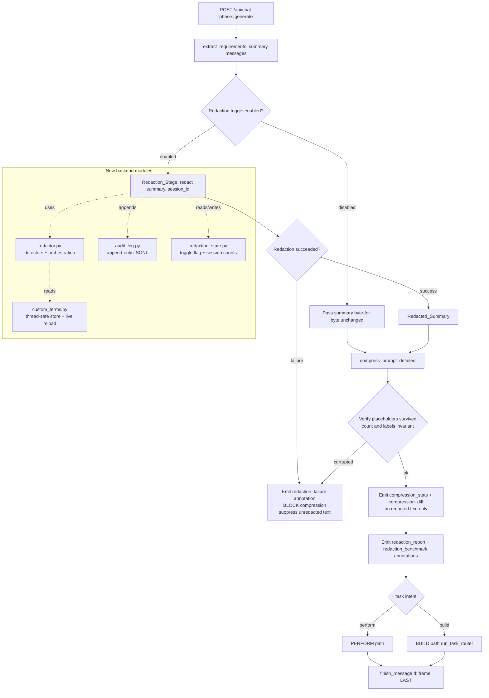

# Design Document: Pre-Inference Redaction

## Overview

This design adds a **pre-inference redaction stage** to TokenQuick's FastAPI backend. In the `/api/chat` `generate` phase, sensitive data is detected and redacted in the requirements summary **before** it reaches `compress_prompt_detailed`, the local model, or any streamed artifact. Detection runs entirely on-device: local regexes for structured secrets, a local spaCy NER model for names/entities, and a user-configurable custom-term list. Every redaction is recorded to an append-only local audit log (category + timestamp + session id, never the raw value), surfaced in a new "Redaction Report" dashboard panel via a `redaction_report` data annotation, is independently toggleable, and is independently benchmarked (latency, per-category counts, chars redacted).

The design's central challenge (Requirement 11) is that the existing compressor's tokenizer and reconstruction step split and rewrite text around the characters `{ } [ ] : ,` — exactly the characters in a naive placeholder like `[REDACTED:email]`. The design solves this by choosing a placeholder format that contains **none** of the compressor's structural characters and by force-preserving placeholders in the compressor, then verifying placeholder invariance after compression and failing closed on corruption.

**Design maps to requirements:** Overview & Architecture → Req 1, 8; Detectors → Req 2, 3, 4; Placeholder preservation → Req 11; Custom terms store/endpoints → Req 4, 5; Audit log → Req 6; Annotations & benchmark → Req 7, 9; Frontend → Req 7, 9, 10; Error Handling → the IF-THEN criteria across requirements; Correctness Properties & Testing → all testable criteria.

### Guiding constraints

- **Nothing leaves the machine.** No detector, the NER model, the audit log, custom-term storage, or benchmarking makes any network call. The spaCy model is loaded from a local artifact. (Non-Goals & Constraints.)
- **Redaction is inserted in the generate phase only**, between `extract_requirements_summary(messages)` and `compress_prompt_detailed(summary)`. The elicitation flow is untouched.
- **Fail closed.** Any redaction failure or placeholder corruption suppresses the unredacted/corrupted text from every downstream step and annotation (Req 1.7, 11.5).

## Architecture

### Generate-phase pipeline with the redaction stage inserted



### Placement in `main.py` (grounded in existing code)

The existing `generate` branch runs, in order:

1. `summary = extract_requirements_summary(messages)`
2. `detail = compress_prompt_detailed(summary)` → `{compressed, tokens, stats}`
3. emits `compression_stats` and `compression_diff` via `data_annotation(payload)` (which formats `f"2:{json.dumps([payload])}\n"`)
4. task routing (PERFORM via `invoke_sync`, or BUILD via `run_task_router`)
5. `finish_message("stop", ...)` emits the `d:` frame **last**

The redaction stage is inserted **between step 1 and step 2**. It redacts the summary in place, and the redacted summary becomes the sole input to `compress_prompt_detailed`. All existing annotations (`compression_stats`, `compression_diff`) are computed from the **redacted** text, so no raw sensitive value can appear in them (Req 1.5). The new `redaction_report` and `redaction_benchmark` annotations are emitted after compression and before `finish_message` (Req 7.1, 9.4).

### New modules

| Module | Responsibility | Requirements |
|---|---|---|
| `backend/redactor.py` | Detector interface, built-in regex detectors, NER detector, custom-term detector, `redact()` orchestration, `RedactionResult`, placeholder format + post-compression verification helper | 1, 2, 3, 11 |
| `backend/custom_terms.py` | Thread-safe in-memory custom-term store, load/validate from config, add/remove with persistence, mtime-based live reload | 4, 5 |
| `backend/audit_log.py` | Append-only JSONL audit log writer, resilient to append failures | 6 |
| `backend/redaction_state.py` | In-memory toggle flag (default enabled) + per-session cumulative category counts | 7, 8 |

### Session id acquisition and propagation

No session id exists in the request today. The design defines it as follows (Req 6.1, 7.1, 7.2, 7.5):

- The `/api/chat` request body **MUST** include a stable `sessionId` string on every `generate` request. The frontend generates a stable id **once** per chat session (`crypto.randomUUID()` stored in React state, reset only by `resetChat`) and sends that same id on every `generate` request for the life of the session. This is a hard requirement, not a best-effort convenience: the id is what ties successive requests together for cumulative counting.
- **Missing/empty `sessionId` is a client error, not a fallback.** If a `generate` request arrives with a missing or empty `sessionId`, the backend rejects it as a client error and does **not** run redaction with an ephemeral, per-request id. For a non-streaming rejection this is an HTTP 400 with a descriptive body (e.g. `{"error": "missing sessionId"}`); on the streaming `generate` path the backend emits a `redaction_failure`-style annotation (reason `missing_session_id`) and ends the response with the finish frame without invoking `compress_prompt_detailed` on the unredacted summary. The backend never invents an id via `uuid.uuid4()` for a generate request.
- **Why this preserves the Req 7.2 invariant.** Per-session cumulative counts live in `redaction_state.session_counts` keyed by `session_id`. A previously-considered fallback that generated a fresh `uuid.uuid4().hex` per request would produce a *different* key on every request, so counts could never accumulate across requests whenever the frontend omitted the id — directly violating Req 7.2 in exactly that case. Requiring a stable id (and rejecting requests that lack one) guarantees every counted request is tied to a stable key, so the cumulative-count invariant always holds.
- **Tradeoff.** This shifts responsibility to the frontend to always supply a stable id. That is acceptable for this single-machine app and is enforced by the frontend wiring task (generate/store a stable session id per chat session, reset by `resetChat`). It is consistent with the frontend session-id wiring already described in this design.
- The session id is threaded from the `generate` handler into `redact(text, session_id)`, into each audit entry, and into the `redaction_report`/`redaction_benchmark` annotation payloads. The dashboard compares the annotation's `sessionId` against its current session to decide whether to update the panel (Req 7.4, 7.5).

## Components and Interfaces

### Detector interface (`redactor.py`)

```python
from dataclasses import dataclass
from typing import Protocol

@dataclass(frozen=True)
class Span:
    start: int          # inclusive char offset into the ORIGINAL text
    end: int            # exclusive char offset
    category: str       # one of the defined Category values
    # NOTE: no raw value is ever stored on a Span.

class Detector(Protocol):
    category: str
    def detect(self, text: str) -> list[Span]:
        """Return all spans this detector matches in `text`. Pure, no I/O."""
        ...
```

Every detector is a pure function of its input text (the custom-term detector reads a snapshot of the term list passed in at construction, so `detect` itself stays pure and deterministic for a given snapshot).

### Built-in regex detectors (Req 2)

Six regex detectors, one per structured category. All patterns are compiled once at import and executed locally (Req 2.6). Each returns `Span`s with its category:

| Category | Pattern intent (illustrative) |
|---|---|
| `ssn` | `\b\d{3}-\d{2}-\d{4}\b` (and space/no-delimiter variants) |
| `credit_card` | 13–19 digit runs with optional spaces/dashes; validated by Luhn to cut false positives |
| `email` | `\b[\w.+-]+@[\w-]+\.[\w.-]+\b` |
| `phone` | common US/intl formats: `\+?\d[\d\s().-]{7,}\d` |
| `api_key` | alternation of `sk-[A-Za-z0-9]{16,}`, `AKIA[0-9A-Z]{16}`, `ghp_[A-Za-z0-9]{36}`, `Bearer\s+[A-Za-z0-9._\-]+` (Req 2.5) |

Multiple matches of the same pattern are all returned in one pass (Req 2.7). Overlap/precedence across categories is resolved centrally in `redact()` (see below), satisfying Req 2.8.

### NER detector (Req 3)

- A spaCy small model (e.g. `en_core_web_sm`) is loaded from a **local artifact** at backend startup, before the first generate request is served (Req 3.4). Loading is attempted once in a FastAPI startup handler.
- The detector extracts `PERSON` (and optionally `ORG`/`GPE`) entity spans and emits them under category `person` (Req 3.1). It makes no network call (Req 3.3).
- **Graceful fallback (Req 3.5):** if the artifact is unavailable or fails to load, `redaction_state.ner_available` is set `False`, a log entry records "NER disabled", and the NER detector is omitted from the detector list — the regex and custom-term detectors continue operating, and **no** `person` redaction is emitted until the model loads.

```python
class NerDetector:
    category = "person"
    def __init__(self, nlp_or_none):
        self._nlp = nlp_or_none
    def detect(self, text: str) -> list[Span]:
        if self._nlp is None:
            return []                      # fallback: no person spans
        doc = self._nlp(text)
        return [Span(e.start_char, e.end_char, "person")
                for e in doc.ents if e.label_ in ("PERSON", "ORG", "GPE")]
```

### Custom-term detector (Req 4.2)

- Constructed with a snapshot of the current term list (a `frozenset` of lowercased terms plus a compiled alternation regex for efficiency).
- Matches full terms case-insensitively as whole occurrences (word-boundary aware), emitting `custom_term` spans.

### `redact()` orchestration (Req 1, 2.8, 3.2)

```python
def redact(text: str, session_id: str) -> RedactionResult:
    ...
```

Algorithm:

1. Record `start = time.perf_counter()`.
2. Run every active detector over `text`, collecting all `Span`s.
3. **Resolve overlaps by fixed precedence.** Precedence order (highest first): `ssn`, `credit_card`, `api_key`, `email`, `phone`, `custom_term`, `person` (Req 2.8, 3.2). Sort candidate spans; when two spans overlap, keep the higher-precedence one and drop/trim the lower so each character is redacted at most once under the earliest-matched category. This guarantees no duplicate `person` redaction over characters already claimed by a regex or custom-term detector (Req 3.2).
4. **Replace spans right-to-left.** Sort the surviving, non-overlapping spans by `start` descending and splice each one out, substituting its `Redaction_Placeholder`. Right-to-left splicing keeps earlier offsets valid as later ones are replaced. Non-span characters are copied byte-for-byte (Req 1.4).
5. For each replaced span, append an audit entry (`audit_log.append(category, session_id)`) and increment `redaction_state` session counts.
6. Compute per-category counts, total chars redacted (sum of original span lengths), and `latency_ms = (perf_counter() - start) * 1000`.
7. Return a `RedactionResult`.

If the input has no spans, the text is returned unchanged and passed to compression (Req 1.6, 2.9).

### Placeholder preservation verification (Req 11.5)

`verify_placeholders(redacted_summary, compressed_output) -> bool`:

- Extracts placeholders from both strings using the placeholder regex (see Data Models).
- Returns `True` iff the **multiset of placeholder tokens** (and therefore count and label set) is identical in both. Any mismatch → the caller treats it as a redaction failure and applies Req 1.7 (block compression output, emit failure).

**Confirmed: the multiset (count + label) check is safe against legitimate compression.** `compress_prompt_detailed` performs **no content-level deduplication** (verified against `backend/compressor.py`). Its pipeline is `_tokenize` → `_score_and_tag_tokens` → `_reconstruct`: each token is scored and kept/dropped **independently** against a rank threshold, and reconstruction only collapses whitespace and cleans up orphaned commas/colons. There is no phrase/sentence dedup, no `seen`-set, and no distinct/unique pass. Therefore two identical placeholders arising from a repeated sensitive value are each scored and preserved independently — legitimate compression will not collapse duplicate placeholders and will not falsely trigger a `redaction_failure`. The multiset comparison is the correct check precisely because duplicates survive as duplicates.

**Forward-looking guardrail.** If content-level deduplication is ever added to the compressor, placeholder tokens (those matching `PLACEHOLDER_RE`) MUST be exempted from that dedup, so duplicate placeholders continue to survive compression. Additionally, the placeholder-preservation property test (Property 3 / Req 11.3) MUST include a case with a repeated sensitive value that produces ≥2 identical placeholders, locking in that duplicates survive compression and that the multiset check does not false-positive.

### FastAPI endpoints

Custom terms (Req 5):

| Method | Path | Request body | Success response | Errors |
|---|---|---|---|---|
| GET | `/api/redaction/terms` | — | `{"terms": ["acme", ...]}` (empty list if none) | — |
| POST | `/api/redaction/terms` | `{"term": "Acme Corp"}` | `{"terms": [...]}` updated list | 400 `{"error": "empty term"/"term exceeds 256 chars"}`; 500 `{"error": "not persisted", "terms": [...]}` |
| DELETE | `/api/redaction/terms` | `{"term": "Acme Corp"}` | `{"terms": [...], "removed": true}` | `{"terms": [...], "removed": false}` when absent (Req 5.6); 500 persistence error |

Behavior: POST trims whitespace, rejects empty-after-trim or >256 chars (Req 5.2, 5.5); case-insensitive duplicate leaves list unchanged and returns existing list (Req 5.3); DELETE matches case-insensitively (Req 5.4). Every mutation persists to the config; on persistence failure the in-memory list is retained, the prior config file is left unchanged, and a descriptive error is returned (Req 4.8, 5.7).

Toggle (Req 8):

| Method | Path | Request body | Response |
|---|---|---|---|
| GET | `/api/redaction/toggle` | — | `{"enabled": true}` (Req 8.4) |
| POST | `/api/redaction/toggle` | `{"enabled": false}` | `{"enabled": false}` — applies to generate requests that begin after the change; in-flight requests keep their prior state (Req 8.3) |

## Data Models

### `RedactionResult` dataclass (`redactor.py`)

```python
@dataclass
class RedactionResult:
    redacted_text: str                 # summary with placeholders substituted
    redactions: list[Span]             # category + start/end offsets, NO raw value
    category_counts: dict[str, int]    # per-category count, this request
    chars_redacted: int                # sum of original span lengths
    latency_ms: float                  # non-negative, stage start→completion
    ok: bool = True                    # False on redaction failure (Req 1.7)
```

`redactions` carries only category and offsets — never the raw value — so the object itself cannot leak a secret if serialized (supports Req 6.3, 7.3).

### Placeholder format decision (Req 11) — the central design section

**Requirement 11.4 literally asks the placeholder to include "the bracket characters" and be preserved byte-for-byte.** The existing compressor makes any placeholder that uses `{ } [ ] : ,` unsafe: `_tokenize` isolates those characters as separate tokens, `_score_token` may drop the label word, and `_reconstruct` strips whitespace around them and collapses commas/colons. A naive `[REDACTED:email]` would be split into `[`, `REDACTED`, `:`, `email`, `]`, the label could be scored away, and reconstruction would mangle spacing.

Two viable approaches were considered:

**Option A — Placeholder that avoids all structural chars (recommended).**
Use delimiters that are not in `JSON_STRUCTURAL` and not the double-quote, so the tokenizer emits the whole placeholder as **one bare word** and reconstruction never rewrites it. Chosen format:

```
⟦REDACTED_EMAIL⟧      ⟦REDACTED_SSN⟧      ⟦REDACTED_CREDIT_CARD⟧
⟦REDACTED_API_KEY⟧    ⟦REDACTED_PHONE⟧    ⟦REDACTED_CUSTOM_TERM⟧   ⟦REDACTED_PERSON⟧
```

- Delimiters `⟦` (U+27E6) and `⟧` (U+27E7) contain no whitespace and none of `{ } [ ] : , "`, so `_tokenize`'s bare-word branch captures the entire token intact.
- The category label uses `_` (uppercased category), so it reads as a single `snake_case`-ish identifier. It contains no character from the original span (Req 1.3).
- It is human-readable in the diff view (`⟦REDACTED_EMAIL⟧`), satisfying the readability goal in Req 11.

**Option B — Keep the human-friendly `[REDACTED:email]` and add a protect-list to the compressor.**
Add an explicit protect-list so the compressor force-preserves placeholder tokens and exempts them from `_reconstruct`'s punctuation stripping. This requires re-tokenizing to recognize the multi-token placeholder and guarding every rewrite rule — significantly more invasive and fragile against future compressor tweaks.

**Decision: Option A, plus a minimal force-preserve guard.** Option A keeps the compressor's structural logic untouched and makes corruption structurally impossible for the common path, while Option B fights the reconstruction rules. We keep the placeholder atomic AND add a small preserve guard in the compressor as defense-in-depth:

**Compressor modification (small, localized):**

1. In `compressor.py`, define `PLACEHOLDER_RE = re.compile(r"⟦REDACTED_[A-Z_]+⟧")`.
2. In `_score_and_tag_tokens`, after scoring, force `preserve = True` for any token whose text fully matches `PLACEHOLDER_RE` (Req 11.2 — retained regardless of heuristic score, never split/merged/discarded). Because Option A placeholders tokenize as a single bare word, no split/merge can occur.
3. `_reconstruct` already only rewrites spacing around `{ } [ ] : ,` and quotes; since the placeholder contains none of those, it passes through byte-for-byte (Req 11.4). No change needed there, but a regression test locks this in.
4. After `compress_prompt_detailed`, the generate handler calls `verify_placeholders(redacted_summary, compressed)`; if the placeholder multiset differs, apply Req 1.7 (treat as redaction failure) (Req 11.3, 11.5).

**No content-level dedup in the compressor (confirmed).** `compress_prompt_detailed` performs no content-level deduplication (verified against `backend/compressor.py`): token scoring and reconstruction operate per-token, so duplicate placeholders survive independently and the multiset check will not false-positive. This is why `verify_placeholders` can safely use a multiset (count + labels) comparison — a repeated sensitive value yields ≥2 identical placeholders, and each is scored and preserved on its own. **Guardrail:** if content-level deduplication is ever added to the compressor, placeholder tokens matching `PLACEHOLDER_RE` MUST be exempted from dedup, and Property 3 (Req 11.3) MUST cover a repeated-value case producing ≥2 identical placeholders.

Placeholder ↔ category mapping is a single dict in `redactor.py` used both to build placeholders and to translate a placeholder back to a category for verification and diff rendering.

### Custom-terms config (`custom_terms.py`) (Req 4)

- **Location/format:** `backend/redaction_terms.json`, a JSON array of strings, e.g. `["Acme Corp", "Project Bluebird"]`. (A `.kiro-local` sibling path is acceptable; JSON is chosen for simple, atomic read/write.)
- **In-memory store:** a class holding the term list plus a derived lowercased set and compiled matcher, guarded by a `threading.Lock` for thread-safe reload/mutation.
- **Load & validation (Req 4.1, 4.3):** on startup load up to 10,000 terms, each 1–256 chars. Skip empty, >256-char, or duplicate (case-insensitive) terms, loading the rest and recording a skip entry with the reason. If the file is missing/unreadable, start with an empty list and record that the config was not loaded (Req 4.9).
- **Live reload (Req 4.6):** store the config file's mtime; on each generate request (and/or a lightweight periodic check), if mtime changed, reload under the lock. Because reload happens at request entry, any modification is reflected on requests beginning >2s later.
- **Add/remove (Req 4.4, 4.5, 4.7):** mutate the in-memory list under the lock, then persist to the config file (atomic write: temp file + `os.replace`). On persistence failure keep the in-memory list, leave the prior file unchanged, and surface the error (Req 4.8).

### Audit log (`audit_log.py`) (Req 6)

- **Storage:** append-only JSONL file, e.g. `backend/redaction_audit.jsonl` (local path).
- **Entry schema (Req 6.1, 6.3):** `{"timestamp": "<ISO-8601>", "category": "email", "session_id": "<id>"}` — no raw value and no ≥4-char substring of it.
- **Append (Req 6.2, 6.4):** open in append mode, write one JSON object per line, flush. Appending never rewrites prior lines.
- **Failure handling (Req 6.5):** if the append raises, catch it, continue processing the redaction, and record (in the app log, never the audit file) that the entry could not be written — without exposing the raw value.

### Toggle & session state (`redaction_state.py`) (Req 7.2, 8.6)

```python
class RedactionState:
    enabled: bool = True                              # default enabled (Req 8.6)
    session_counts: dict[str, dict[str, int]] = {}    # session_id -> {category -> cumulative count}
```

Cumulative per-session counts back the `redaction_report` annotation (Req 7.2). Reads/writes are guarded so concurrent generate requests stay consistent.

### Data annotation contract

Both annotations are emitted via the existing `data_annotation(payload)` helper (`f"2:{json.dumps([payload])}\n"`), before `finish_message` (Req 7.1, 9.4). They mirror the shape of `compression_stats`.

`redaction_report` (Req 7.1–7.3, 8.5):

```json
{
  "event": "redaction_report",
  "sessionId": "…",
  "stageEnabled": true,
  "counts": { "email": 2, "person": 1 },
  "totalRedactions": 3
}
```

- `counts` includes one entry per category with ≥1 cumulative redaction this session (Req 7.2). When the stage is disabled, `stageEnabled=false`, `counts={}`, `totalRedactions=0` (Req 8.5). No raw values (Req 7.3).

`redaction_benchmark` (Req 9.2–9.4, 9.6):

```json
{
  "event": "redaction_benchmark",
  "sessionId": "…",
  "stageEnabled": true,
  "latencyMs": 12.4,
  "charsRedacted": 41,
  "perCategoryCounts": { "ssn": 0, "credit_card": 0, "api_key": 1, "email": 2, "phone": 0, "custom_term": 0, "person": 1 }
}
```

- `perCategoryCounts` defaults every built-in category to 0 (Req 9.2, 9.6). Values are the counts for **this** request (benchmark), distinct from the session-cumulative `redaction_report.counts`.

`redaction_failure` (Req 1.7, 11.5):

```json
{ "event": "redaction_failure", "sessionId": "…", "reason": "placeholder_corruption" | "detector_error" | "missing_session_id" }
```

- Emitted instead of `compression_stats`/`compression_diff`/output when redaction cannot complete or placeholders were corrupted. The unredacted/corrupted text is never streamed and never appears in any annotation.

`redaction_benchmark_unavailable` (Req 9.7):

```json
{ "event": "redaction_benchmark_unavailable", "sessionId": "…" }
```

- Emitted when a benchmark value cannot be captured; processing continues and the redacted output is still produced (does not block Req 9.7).

## Correctness Properties

*A property is a characteristic or behavior that should hold true across all valid executions of a system — essentially, a formal statement about what the system should do. Properties serve as the bridge between human-readable specifications and machine-verifiable correctness guarantees.*

The redaction stage is a strong fit for property-based testing: the detectors, overlap resolver, placeholder substitution, and benchmark counting are pure functions with clear input/output behavior and a large input space. The recommended framework is **Hypothesis** (Python), since the backend is Python. Properties below were derived from the prework analysis and consolidated to remove redundancy.

### Property 1: No sensitive value leaks downstream

*For any* input text containing detected sensitive spans, no substring of length 4 or greater of any detected span appears in the redacted text (the compressor input), in the compressor output, or in any emitted generate-phase data annotation payload (`compression_stats`, `compression_diff`, `redaction_report`, `redaction_benchmark`).

**Validates: Requirements 1.5, 2.1, 2.2, 2.3, 2.4, 2.5, 7.3**

### Property 2: Redaction is idempotent

*For any* input text, redacting the already-redacted output produces the same set of placeholders and introduces no additional redactions (placeholders themselves contain no sensitive characters, so they are never re-detected).

**Validates: Requirements 1.3, 1.4**

### Property 3: Placeholders are invariant through compression

*For any* Redacted_Summary, the multiset of Redaction_Placeholders (their count and their set of Category labels) in the compressor output is identical to that in the Redacted_Summary, and each placeholder's characters are preserved byte-for-byte (delimiters and label unaltered, never split, merged, or discarded). This holds even when the summary contains **duplicate identical placeholders** (from a repeated sensitive value): the generator MUST include a case producing ≥2 identical placeholders, and the compressor MUST preserve all of them (it performs no content-level dedup — confirmed against `backend/compressor.py`).

**Validates: Requirements 11.1, 11.2, 11.3, 11.4**

### Property 4: Non-sensitive text is preserved byte-for-byte

*For any* input text, every character outside a detected Sensitive_Span is present, unchanged, and in the same relative order in the redacted output; a text with no detected span is returned unchanged.

**Validates: Requirements 1.4, 1.6, 2.9**

### Property 5: Audit log never contains raw values

*For any* input text that is redacted, no substring of length 4 or greater of any redacted value appears in any Audit_Log entry, and each entry contains an ISO-8601 timestamp, a Category, and the Session_Id.

**Validates: Requirements 6.1, 6.3**

### Property 6: Disabled stage passes text through byte-for-byte

*For any* input text, when the Redaction_Stage is disabled the output equals the input byte-for-byte, no scan or redaction occurs, and no Audit_Log entry is appended.

**Validates: Requirements 8.2**

### Property 7: Matched values are redacted with the correct placeholder and count

*For any* text containing k independent values matching a built-in or custom-term pattern (with custom terms matched case-insensitively as full occurrences), the output contains exactly k placeholders of the corresponding Category and none of the original values.

**Validates: Requirements 2.7, 4.2**

### Property 8: Overlaps resolve to the single highest-precedence category

*For any* set of detected spans (across regex, custom-term, and NER detectors), the resolved redactions are non-overlapping and each originally covered character is redacted exactly once under the earliest-matched Category per the fixed precedence `ssn, credit_card, api_key, email, phone, custom_term, person`, with no duplicate `person` redaction over characters already claimed by another detector.

**Validates: Requirements 2.8, 3.2**

### Property 9: Benchmark values are non-negative and complete

*For any* input text, the Redaction_Benchmark reports `latencyMs >= 0`, `charsRedacted >= 0` equal to the sum of redacted span lengths, and a per-Category integer count `>= 0` for every built-in Category (defaulting to 0), including all-zero values when nothing is redacted.

**Validates: Requirements 9.1, 9.2, 9.3, 9.6**

### Property 10: Session redaction counts are cumulative

*For any* sequence of generate requests within a single session, the `redaction_report` count for each Category equals the cumulative number of redactions recorded for that Category across those requests.

**Validates: Requirements 7.2**

### Property 11: One audit entry per redaction, append-only

*For any* input text redacting k spans, exactly k new entries are appended to the Audit_Log and all previously written entries remain byte-for-byte unchanged.

**Validates: Requirements 6.1, 6.4**

### Property 12: Custom-term loading respects validation bounds

*For any* candidate term list, the loaded term set contains exactly the terms that are non-empty, at most 256 characters, and not case-insensitive duplicates (up to the 10,000-term cap), and every skipped term is recorded with a reason.

**Validates: Requirements 4.1, 4.3**

## Error Handling

Each IF-THEN acceptance criterion maps to concrete behavior:

| Requirement | Condition | Behavior |
|---|---|---|
| 1.7 | Redaction cannot complete (detector raises, or verification fails) | Block invocation of `compress_prompt_detailed`; never stream or annotate the unredacted summary; emit `redaction_failure` with a reason; end the response with the finish frame. |
| 7.2 | A `generate` request arrives with a missing or empty `sessionId` | Treat as a client error: do **not** generate an ephemeral per-request id and do **not** run redaction on an ephemeral key. Non-streaming: return HTTP 400 `{"error": "missing sessionId"}`. Streaming `generate` path: emit a `redaction_failure` annotation with reason `missing_session_id`, skip `compress_prompt_detailed` on the unredacted summary, and end with the finish frame. This keeps every counted request tied to a stable `session_counts` key, preserving the Req 7.2 cumulative-count invariant. |
| 3.5 | NER model artifact unavailable/fails to load at startup | Set `ner_available=False`, log "NER disabled", omit the NER detector; regex + custom-term detectors keep running; emit no `person` redactions until the model loads. |
| 4.8 | Persisting the custom-term list fails | Retain the in-memory list, leave the prior config file bytes unchanged (atomic temp-file write is never swapped in), return a response indicating persistence failure. |
| 5.5 | Submitted term empty after trim or >256 chars | Reject the request, leave config unchanged, return a descriptive 400 error. |
| 5.7 | Persisting a term change fails | Return a descriptive error indicating the change was not persisted. |
| 6.5 | Appending an audit entry fails | Continue processing the redaction; record (in the app log, not the audit file) that the entry could not be written; never expose the raw value. |
| 7.5 | `redaction_report` annotation's session id does not match the current session | Dashboard leaves the current Redaction_Report panel contents unchanged. |
| 9.7 | A benchmark value cannot be captured | Emit `redaction_benchmark_unavailable`; continue processing; still produce the redacted output (do not block the stage). |
| 11.5 | Placeholder cannot be preserved / is corrupted through compression | `verify_placeholders` returns false; treat as a redaction failure and apply Req 1.7 (suppress the corrupted compressor output from every downstream step and annotation). |

Additional non-IF-THEN robustness: `4.9` (missing/unreadable config) starts with an empty list and records the condition; `3.4` load attempt happens in the startup handler before the first request is served.

## Testing Strategy

A dual approach: property-based tests for universal invariants and example/integration tests for specific behaviors and error paths.

### Property-based tests (Hypothesis)

- Framework: **Hypothesis** for Python. The backend has no PBT dependency today; add `hypothesis` to `backend/requirements.txt` (pinned).
- Each of the 12 correctness properties above is implemented by a **single** property-based test, configured to run a **minimum of 100 iterations** (`@settings(max_examples=100)` or higher).
- Each test is tagged with a comment referencing its design property, using the format:
  `# Feature: pre-inference-redaction, Property {number}: {property_text}`
- Custom strategies generate: valid values per category (SSNs, Luhn-valid card numbers, emails, phones, `sk-`/`AKIA`/`ghp_`/`Bearer` keys), random prose interleaved with secrets, random custom-term lists (valid/invalid/duplicate), random overlapping span sets for the resolver, and redacted texts with placeholders in varied positions for the compression-invariance property.
- Privacy properties (P1, P5) assert the "no length-4 window of any secret appears" invariant by sliding a 4-char window over each original secret and searching the redacted text / annotation payloads / audit lines.

### Example-based unit tests

- Error paths (Req 1.7, 3.5, 4.8, 4.9, 5.5, 5.7, 6.5, 9.7, 11.5): force the failing condition (inject a raising detector, `nlp=None`, a read-only/failing file, a corrupting compressor stub) and assert the specified behavior.
- Placeholder-preservation regression: a fixed test that runs each placeholder through `compress_prompt_detailed` and asserts byte-for-byte survival — locks in the Option A format against future compressor edits. This MUST include a **repeated-value case** (a summary with ≥2 identical placeholders) asserting both survive compression, so a future content-level dedup change to the compressor cannot silently collapse duplicate placeholders and false-trigger `verify_placeholders` (Property 3 / Req 11.3).
- NER examples (Req 3.1): representative sentences with clear person names.
- Custom-term store add/remove/reload semantics and persistence round-trip (Req 4.4–4.7).

### Integration tests (FastAPI TestClient)

- Endpoint behaviors (Req 5.1–5.7, 8.4): GET/POST/DELETE terms and GET/POST toggle, asserting response shapes and status.
- Generate-stream assertions: run a `generate` request and assert annotation ordering — `redaction_report` and `redaction_benchmark` appear **before** the `d:` finish frame (Req 9.4), and that `compression_stats`/`compression_diff` reflect the redacted text (Req 1.5, 8.1).
- Toggle behavior (Req 8.3, 8.5): flip the toggle and assert the new state applies to subsequent generate requests and that a disabled run emits a zeroed, `stageEnabled:false` report.
- No-network checks (Req 2.6, 3.3): run detection with outbound network blocked/mocked and assert no calls are made.

### Frontend component tests

- `RedactionReport` panel: renders per-category counts on a matching session id, ignores mismatched session ids (Req 7.4, 7.5), shows the empty-state message at zero redactions (Req 7.6), and presents benchmark numbers with the same layout/units as the compression stats panel (Req 9.5).
- `Settings` screen: load/add/remove flows with pending and error states (Req 10.1–10.6).

## Frontend

The frontend consumes annotations through the same Vercel AI SDK data-stream loop already in `frontend/app/page.tsx` (the `processLine` handler that switches on `payload.event`). Two new event handlers set React state for `redaction_report` and `redaction_benchmark`; a `redaction_failure` handler surfaces an error banner and clears the redaction panels.

### `RedactionReport` panel (`frontend/components/RedactionReport.tsx`)

- Rendered in the **right pane**, alongside the existing Token Compression Report, matching its card styling (`rounded-xl bg-slate-800 border border-slate-700`, `StatBadge`-style figures, uppercase section header).
- Content: one row per Category with a redaction count (Req 7.4); benchmark figures (latency in ms, chars redacted, per-category counts) shown with the same labels/units/layout as the compression stats (Req 9.5) — reusing the `StatBadge` component.
- Empty state: when the session has zero redactions across all categories, show a calm empty-state message ("No sensitive data detected in this session") (Req 7.6).
- Session scoping: the component only updates when the annotation's `sessionId` equals the current session id; mismatched annotations are ignored (Req 7.5).
- Disabled state: when `stageEnabled` is false, indicate the stage was off for the request while still showing zeros (Req 8.5).

### `Settings` screen (`frontend/components/RedactionSettings.tsx`)

- On open, GET `/api/redaction/terms` and render the returned list; on load failure show an error and do **not** render a partial/empty list as the current terms (Req 10.1, 10.5).
- Add: POST the term; while pending, show a pending indicator and do not report success until the backend responds (Req 10.2, 10.6); on success render the returned list; on rejection/failure show an error and retain the previously displayed list (Req 10.4).
- Remove: DELETE the term with the same pending/success/error handling (Req 10.3, 10.4, 10.6).
- All content is local; the screen makes requests only to the local backend, consistent with "nothing leaves the machine".
